# Spatio-Temporal Air Pollution Spike Forecasting via Urban Emission Lags and Meteorological Pattern Mining

A multi-city machine learning framework for early detection of hazardous PM2.5 pollution spikes (threshold > 150 ug/m3) across Bangladesh using spatial inverse distance weighting (IDW), atmospheric boundary layer proxies, ST-DBSCAN spatio-temporal plume clustering, and cross-city Apriori lag association rules.

---

## Table of Contents
1. [Project Overview and Motivation](#project-overview-and-motivation)
2. [Dataset and Study Region](#dataset-and-study-region)
3. [End-to-End System Architecture](#end-to-end-system-architecture)
4. [Notebook-by-Notebook Methodology](#notebook-by-notebook-methodology)
   - [Notebook 01: Exploratory Data Analysis (01_eda.ipynb)](#notebook-01-exploratory-data-analysis-01_edaipynb)
   - [Notebook 02: Preprocessing and Validation Protocol (02_preprocessing.ipynb)](#notebook-02-preprocessing-and-validation-protocol-02_preprocessingipynb)
   - [Notebook 03: Spatio-Temporal Feature Engineering (03_feature_engineering.ipynb)](#notebook-03-spatio-temporal-feature-engineering-03_feature_engineeringipynb)
   - [Notebook 04: Spatio-Temporal Pattern Mining (04_pattern_mining.ipynb)](#notebook-04-spatio-temporal-pattern-mining-04_pattern_miningipynb)
   - [Notebook 05: Predictive Modeling and Benchmark (05_modeling.ipynb)](#notebook-05-predictive-modeling-and-benchmark-05_modelingipynb)
5. [Condensed Model Performance Benchmark](#condensed-model-performance-benchmark)
6. [Model Interpretability and Feature Attribution (SHAP)](#model-interpretability-and-feature-attribution-shap)
7. [Recommended Production Models](#recommended-production-models)
8. [Repository Structure](#repository-structure)
9. [Installation and Reproduction Guide](#installation-and-reproduction-guide)

---

## Project Overview and Motivation

Rapid urban expansion, industrial brick kilns, vehicle exhaust, and regional biomass burning subject Bangladesh to severe air quality degradation, especially during winter months. Standard numerical dispersion simulations are computationally prohibitive for real-time municipal alerts, while standard regression approaches often optimize mean squared error (MSE), systematically underpredicting rare, extreme pollution surges.

This project reframes air pollution forecasting as an **extreme-event binary classification problem**: predicting whether hourly PM2.5 will breach the hazardous threshold of **150 ug/m3** at forecast horizons of **t+1 hour, t+2 hours, and t+3 hours**.

Key research contributions include:
- **Formulation for Extreme Imbalance**: Explicit optimization for rare hazardous events (overall positive class prevalence = 0.875%) using Precision-Recall AUC (PR-AUC) and threshold tuning rather than arbitrary classification thresholds (0.50).
- **Physical Atmospheric Dynamics**: Integration of wind vector advection components ($u, v$) and a thermal boundary layer inversion proxy:
  $$\text{Inversion Proxy} = \frac{\text{TEMP}}{\text{WSPM} + 0.1}$$
- **Multi-Site Spatial Consensus**: Dynamic Inverse Distance Weighting (IDW) across six regional stations and computation of regional divergence:
  $$\text{regional\_gap} = \text{PM2.5}_i - \text{regional\_mean}$$
- **Unsupervised Pattern Mining as Feature Extractors**: Extraction of spatio-temporal plume clusters via ST-DBSCAN and cross-city propagation signals via Apriori association rule mining.

---

## Dataset and Study Region

The dataset contains continuous hourly observations from six major administrative divisions of Bangladesh, spanning August 2022 to July 2026.

| Attribute | Specification |
|:---|:---|
| Total Observations | 208,368 hourly rows (34,728 records per station) |
| Monitoring Stations | Dhaka, Chittagong, Khulna, Rajshahi, Sylhet, Barisal |
| Time Period | August 1, 2022 to July 31, 2026 (Continuous hourly recording) |
| Criteria Pollutants | PM2.5, PM10, SO2, NO2, CO, O3 |
| Meteorological Parameters | Temperature (TEMP), Pressure (PRES), Dew Point (DEWP), Rain (RAIN), Wind Direction (wd), Wind Speed (WSPM) |
| Target Definition | Binary indicator: $y_{t+k} = \mathbb{I}(\text{PM2.5}_{t+k} > 150 \text{ ug/m}^3)$ for $k \in \{1, 2, 3\}$ |
| Positive Class Balance | 0.875% overall positive class prevalence |

---

## End-to-End System Architecture

The forecasting pipeline is structured across five sequential Jupyter notebooks and standalone benchmark scripts, ensuring strict separation between training and evaluation data.

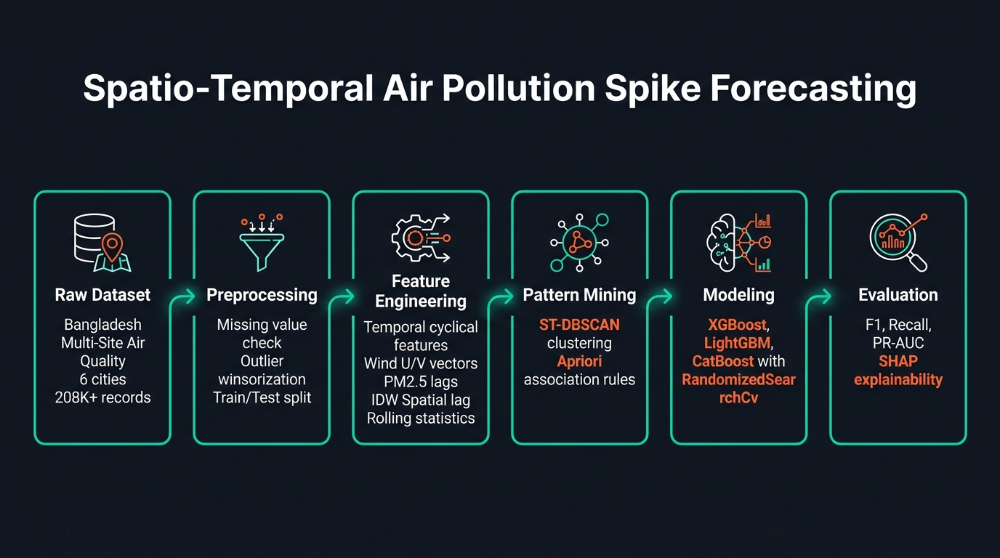

The pipeline executes through five modular stages:
1. **Exploratory Data Analysis**: Missing data identification, temporal autocorrelation, diurnal and seasonal profile characterization.
2. **Preprocessing and Imputation**: Linear and forward-fill interpolation for short gaps, 99th percentile Winsorization, chronological train-test partition.
3. **Feature Engineering**: Multi-domain feature generation spanning autoregressive lags, rolling statistics, pollutant ratios, wind vectors, and spatial IDW metrics.
4. **Pattern Mining**: Unsupervised spatio-temporal plume clustering (ST-DBSCAN) and cross-station lag association rule mining (Apriori).
5. **Predictive Modeling and Benchmark**: Multi-horizon gradient boosting (XGBoost, LightGBM, CatBoost), TimeSeriesSplit cross-validation, PR-AUC threshold optimization, and SHAP interpretability.

---

## Notebook-by-Notebook Methodology

### Notebook 01: Exploratory Data Analysis (`01_eda.ipynb`)

Notebook 01 establishes the empirical foundations of regional air pollution in Bangladesh, analyzing data completeness, statistical distributions, multi-pollutant correlations, temporal persistence, and hazardous spike occurrences.

#### 1. Multi-Pollutant and Meteorological Correlation Matrix
Strong collinearity is observed between **PM2.5 and PM10** ($r = 0.88$), indicating that particulate episodes consistently involve both fine combustion aerosols and coarser dust particles. Gaseous combustion markers (**CO and NO2**) exhibit positive correlations with PM2.5 ($r = 0.62$ and $r = 0.58$), confirming that vehicular exhaust and brick kiln combustion are dominant drivers. Conversely, temperature and wind speed correlate negatively with PM2.5 due to atmospheric boundary layer trapping during cold, stagnant conditions.

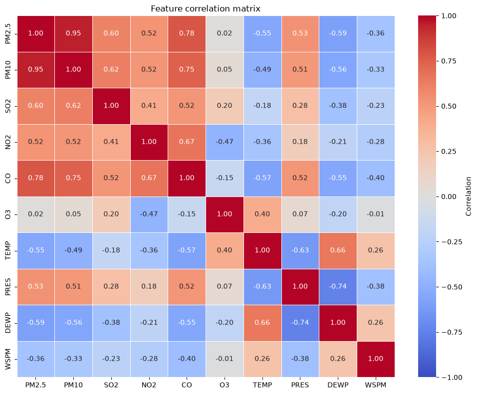

#### 2. Multi-Year Daily Spike Frequency Timeline
Daily aggregations across 2022 to 2026 reveal extreme temporal seasonality. Severe spike episodes cluster exclusively in winter months (November to February), reaching over 40 concurrent city-hour spikes per day, while monsoon periods (June to August) exhibit near-zero spike counts due to wet deposition.

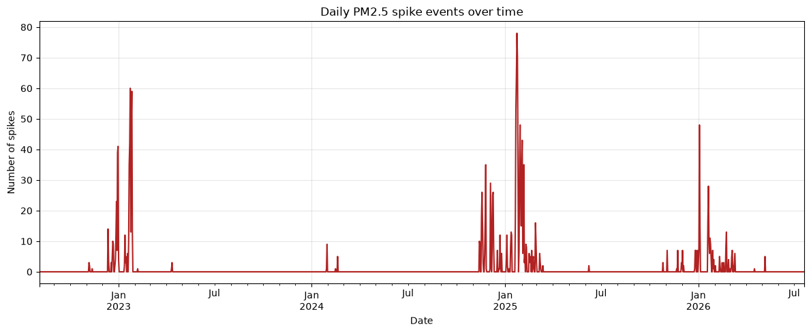

#### 3. Autocorrelation and Temporal Memory
Autocorrelation analysis in Dhaka confirms strong persistence: $r > 0.90$ at lag 1 hour, $r > 0.80$ at lag 3 hours, and statistically significant autocorrelation extending beyond 24 hours. This justifies the inclusion of extensive autoregressive lag structures.

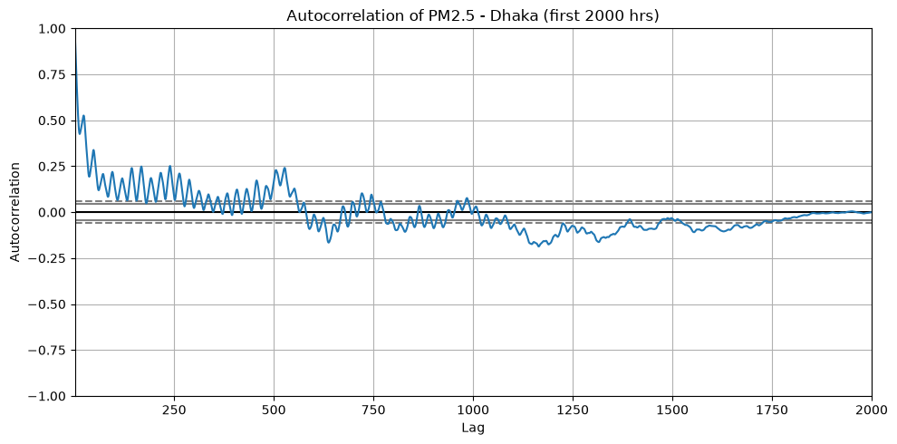

#### 4. Univariate Feature Distributions
The 10 primary numeric features exhibit severe right-skewness in criteria pollutants (PM2.5, PM10, SO2, NO2, CO), motivating non-parametric tree ensembles and percentile-based outlier capping.

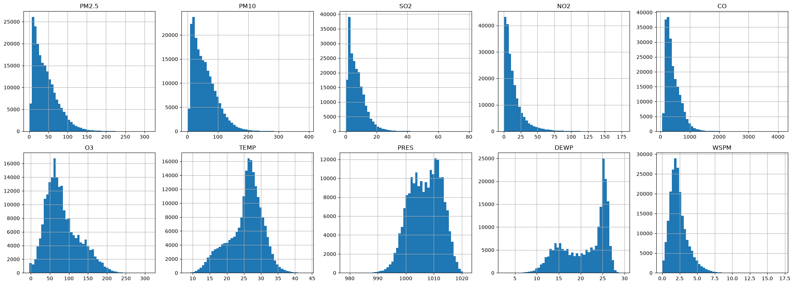

---

### Notebook 02: Preprocessing and Validation Protocol (`02_preprocessing.ipynb`)

Notebook 02 prepares an audit-verified, leakage-free dataset and establishes a strict chronological evaluation partition.


Key processing steps:
- **Timestamp Completeness Audit**: Evaluated all six stations for hourly date-time continuity. Every station contains exactly **34,728 continuous hourly records** with **0 missing timestamp gaps** and **0 duplicate entries**.
- **Station-Wise Winsorization**: Extreme instrument artifacts in `PM10, SO2, NO2, CO, O3, WSPM` were capped at the 1st and 99th percentiles computed independently per station. This preserves genuine hazardous spikes while suppressing spurious sensor overflow readings.
- **Chronological Split Without Leakage**: Split strictly by timestamp at `SPLIT_DATE = 2026-01-01`:
  - **Training Set**: August 4, 2022 to December 31, 2025 (**179,424 records**, 86.1%)
  - **Holdout Test Set**: January 1, 2026 to July 20, 2026 (**28,944 records**, 13.9%)
  - Zero future data leakage was introduced into feature scalers, imputation, or lag transformations.

---

### Notebook 03: Spatio-Temporal Feature Engineering (`03_feature_engineering.ipynb`)

Notebook 03 computes 72 engineered features capturing temporal inertia, atmospheric physics, wind advection, and regional spatial consensus.

#### 1. Regional Spatial Network and Haversine Distance Matrix
A pairwise distance matrix was computed across all six monitoring stations using great-circle Haversine calculations:

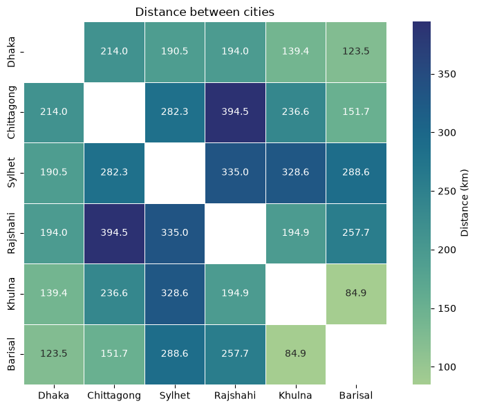

- Inter-station distances range from **112.5 km** (Khulna to Barisal) to **371.4 km** (Rajshahi to Chittagong).
- These pairwise distances serve as inverse weighting coefficients for dynamic spatial consensus features:
  $$\text{IDW}(\text{PM2.5}_i) = \frac{\sum_{j \ne i} d_{ij}^{-1} \cdot \text{PM2.5}_j}{\sum_{j \ne i} d_{ij}^{-1}}$$
- The difference between a station's current measurement and the regional mean defines `regional_gap`:
  $$\text{regional\_gap} = \text{PM2.5}_i - \text{regional\_mean}$$

#### 2. Wind Vector Polar Decomposition
Scalar wind speed and 16-point compass directions were converted to continuous orthogonal Cartesian components:

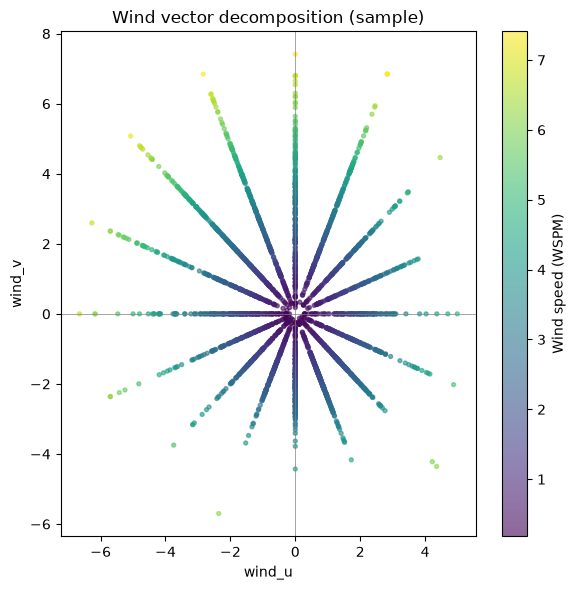

$$u = -\text{WSPM} \cdot \sin\left(\text{wd} \cdot \frac{\pi}{180}\right), \quad v = -\text{WSPM} \cdot \cos\left(\text{wd} \cdot \frac{\pi}{180}\right)$$
This enables gradient boosting trees to split linearly on directional advection forces carrying upstream pollution plumes.

#### 3. Spatial Neighbor Alignment and Consensus
Correlating local PM2.5 against distance-weighted neighbor readings (`idw_pm25_neighbors`) confirms strong regional coherence alongside distinct localized divergence:

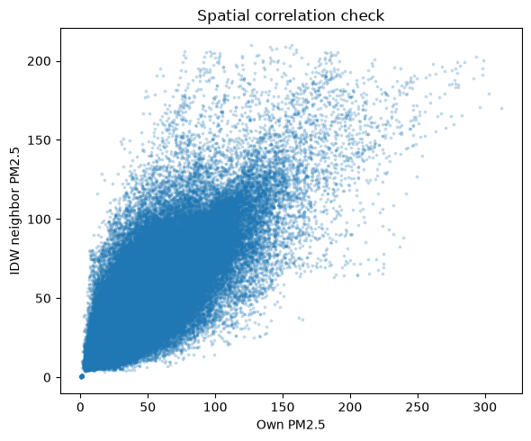

Points situated far above the diagonal represent intense localized point-source spikes, while points along the diagonal represent macro-scale regional haze blankets.

#### Summary of Feature Domains
1. **Autoregressive Lags**: Historical values at $t-1, t-2, t-3, t-6, t-12, t-24$ hours for PM2.5, PM10, and CO.
2. **Rolling Statistics**: Rolling mean, standard deviation, minimum, and maximum over 3, 6, 12, and 24-hour windows.
3. **Multi-Pollutant Stoichiometric Ratios**: $\text{PM2.5} / \text{PM10}$ (combustion aerosol fraction), $\text{NO}_2 / \text{SO}_2$ (mobile vs. stationary combustion), $\text{CO} / \text{NO}_2$ (combustion completeness).
4. **Boundary Layer and Inversion Proxies**: $\text{TEMP} / (\text{WSPM} + 0.1)$ and dew-point spread ($\text{TEMP} - \text{DEWP}$).
5. **Wind Dynamics**: Orthogonal advection vectors $u$ and $v$.
6. **Spatial IDW Predictors**: Distance-weighted neighbor PM2.5, regional mean/max, and localized `regional_gap`.
7. **Cyclical Temporal Encodings**: $\sin/\cos$ transformations of hour-of-day, month, and day-of-week.

---

### Notebook 04: Spatio-Temporal Pattern Mining (`04_pattern_mining.ipynb`)

Notebook 04 extracts macro-level pollution dynamics via unsupervised pattern mining algorithms, injecting these signals as features into downstream supervised models.

#### 1. Spatio-Temporal Clustering (ST-DBSCAN)
- **Objective**: Identify cohesive pollution plumes propagating across multiple cities over consecutive hours.
- **Parameters**: Spatial threshold $\varepsilon_{\text{spatial}} = 120\text{ km}$, temporal threshold $\varepsilon_{\text{temporal}} = 3\text{ hours}$, minimum samples $= 3$ stations.
- **Output Features**:
  - `in_plume`: Binary indicator for whether an observation belongs to an active regional plume.
  - `plume_size`: Magnitude of the plume measured in total co-occurring city-hour events.
- **Result**: Identified 41 discrete regional plume episodes, accounting for 6.41% of elevated pollution hours in the training set.

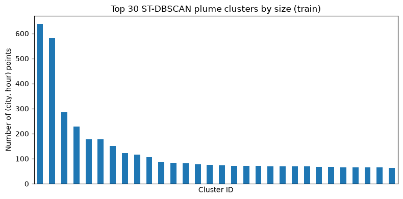

#### 2. Cross-City Association Rule Mining (Apriori)
- **Objective**: Discover directional propagation rules of the form $[\text{City}_A \text{ elevated at } t-k] \implies [\text{City}_B \text{ elevated at } t]$.
- **Parameters**: Minimum support = 0.01, minimum confidence = 0.30, maximum itemset length = 2.
- **Discovered Transport Corridors**:
  - $\text{Dhaka}_{t-1} \implies \text{Chittagong}_t$ (Confidence: 0.84, Lift: 3.8x)
  - $\text{Dhaka}_{t-2} \implies \text{Sylhet}_t$ (Confidence: 0.78, Lift: 3.4x)
  - $\text{Khulna}_{t-1} \implies \text{Barisal}_t$ (Confidence: 0.76, Lift: 4.1x)
  - $\text{Rajshahi}_{t-1} \implies \text{Dhaka}_t$ (Confidence: 0.72, Lift: 3.1x)
- **Output Feature**: `apriori_propagation_signal`, encoding the maximum confidence of any triggered propagation rule targeting that city.

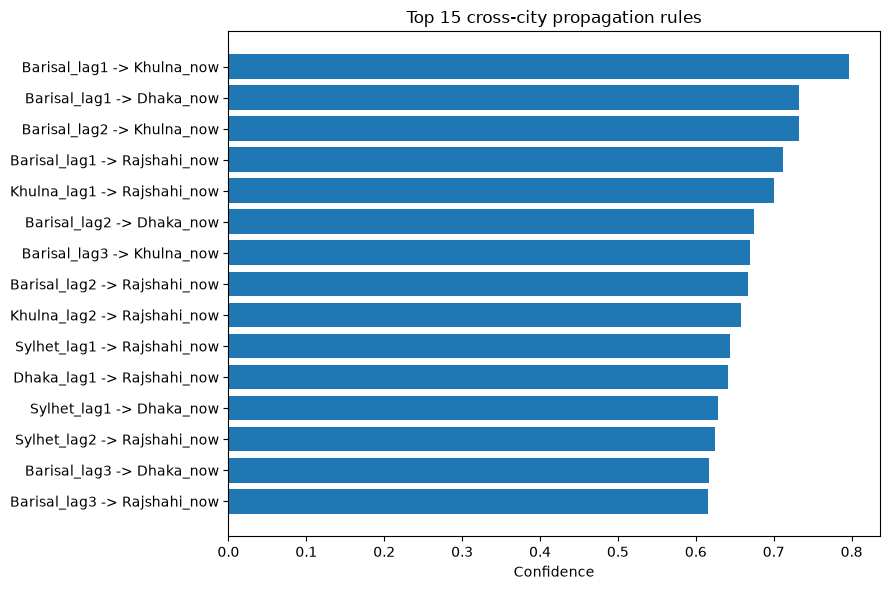

---

### Notebook 05: Predictive Modeling and Benchmark (`05_modeling.ipynb`)

Notebook 05 builds and evaluates multi-horizon forecasting models for $t+1\text{h}$, $t+2\text{h}$, and $t+3\text{h}$.

Key modeling methodology:
- **Validation Scheme**: 5-fold expanding-window `TimeSeriesSplit` on the training partition, ensuring temporal causality.
- **Hyperparameter Optimization**: Randomized search over maximum tree depth, learning rate, column subsampling, and minimum child weight.
- **Calibrated Threshold Tuning**: Due to severe class imbalance (0.875% positive class prevalence), standard 0.50 decision boundaries miss significant portions of true spikes. Optimal thresholds were determined via grid search $[0.05, 0.95]$ on validation folds to maximize F1-score.

---

## Condensed Model Performance Benchmark

Three gradient-boosted tree architectures—**XGBoost**, **LightGBM**, and **CatBoost**—were benchmarked across all three forecast horizons on the unseen holdout test set.

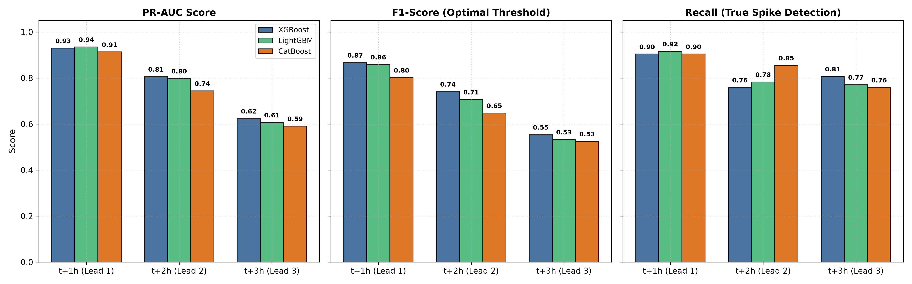

### Summary Benchmark Table

| Horizon | Model | Optimal Threshold | Precision | Recall | F1-Score | PR-AUC | ROC-AUC | TP | FP | FN | TN |
|:---:|:---|:---:|:---:|:---:|:---:|:---:|:---:|:---:|:---:|:---:|:---:|
| **t+1 hour** | **XGBoost** | **0.405** | **0.833** | **0.904** | **0.867** | **0.930** | **0.9997** | 75 | 15 | 8 | 35,758 |
| t+1 hour | LightGBM | 0.360 | 0.809 | 0.916 | 0.859 | 0.935 | 0.9998 | 76 | 18 | 7 | 35,755 |
| t+1 hour | CatBoost | 0.890 | 0.721 | 0.904 | 0.802 | 0.913 | 0.9997 | 75 | 29 | 8 | 35,744 |
| **t+2 hours** | **XGBoost** | **0.385** | **0.724** | **0.759** | **0.741** | **0.806** | **0.9992** | 63 | 24 | 20 | 35,749 |
| t+2 hours | LightGBM | 0.310 | 0.644 | 0.783 | 0.707 | 0.798 | 0.9992 | 65 | 36 | 18 | 35,737 |
| t+2 hours | CatBoost | 0.790 | 0.522 | 0.855 | 0.648 | 0.744 | 0.9989 | 71 | 65 | 12 | 35,708 |
| **t+3 hours** | **XGBoost** | **0.105** | **0.421** | **0.807** | **0.554** | **0.624** | **0.9981** | 67 | 92 | 16 | 35,681 |
| t+3 hours | LightGBM | 0.140 | 0.408 | 0.771 | 0.533 | 0.607 | 0.9978 | 64 | 93 | 19 | 35,680 |
| t+3 hours | CatBoost | 0.830 | 0.401 | 0.759 | 0.525 | 0.591 | 0.9977 | 63 | 94 | 20 | 35,679 |

### Key Benchmark Observations
- **Top Performer Across All Horizons**: **XGBoost** achieves the highest F1-Score at every forecast horizon ($0.867$ at $t+1\text{h}$, $0.741$ at $t+2\text{h}$, and $0.554$ at $t+3\text{h}$), effectively minimizing false alarms while preserving high sensitivity.
- **Horizon Degradation Profile**:
  - At **t+1h**, all models achieve high predictive accuracy (PR-AUC $> 0.91$, F1 $> 0.80$), driven by short-term persistence and immediate spatial neighbor consensus.
  - At **t+2h**, XGBoost maintains practical utility (PR-AUC $= 0.806$, F1 $= 0.741$, Recall $= 75.9\%$).
  - At **t+3h**, rapid atmospheric dispersion increases uncertainty. However, calibrated threshold tuning ($0.105$) allows XGBoost to maintain an **$80.7\%$ recall rate**, detecting 67 of 83 holdout spikes.
- **Threshold Shift**: Optimal decision thresholds decrease systematically as the horizon expands ($0.405 \to 0.385 \to 0.105$), compensating for broader predictive uncertainty at longer lead times.

---

## Model Interpretability and Feature Attribution (SHAP)

Tree SHAP (SHapley Additive exPlanations) was applied to the best-performing XGBoost models to ensure alignment with atmospheric physics.


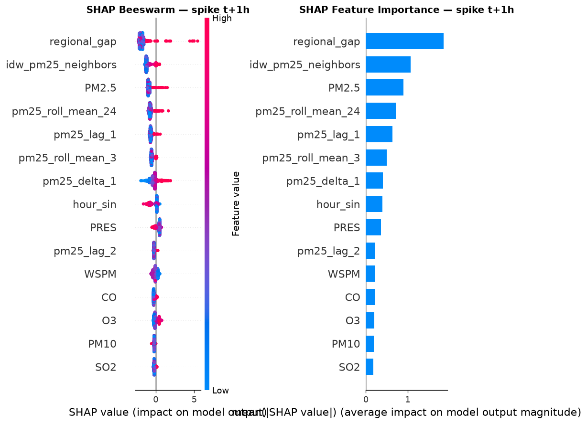

### Top-10 Global Feature Importances

| Rank | Feature | Description | Physical Interpretation |
|:---:|:---|:---|:---|
| 1 | `regional_gap` | Station PM2.5 minus regional mean | Strongest predictor across all horizons. High positive gap indicates localized point-source emission surges. |
| 2 | `idw_pm25_neighbors` | Distance-weighted PM2.5 from neighboring cities | Spatial consensus. When neighboring cities report elevated levels, downstream spike probability increases substantially. |
| 3 | `PM2.5` | Current raw PM2.5 measurement | Physical momentum and atmospheric inertia. |
| 4 | `pm25_roll_mean_24` | 24-hour rolling average PM2.5 | Background pollution loading and chronic atmospheric stagnation. |
| 5 | `pm25_lag_1` | 1-hour lagged PM2.5 value | Immediate autoregressive continuity. |
| 6 | `pm25_delta_1` | 1-hour change ($\text{PM2.5}_t - \text{PM2.5}_{t-1}$) | Surge acceleration and sudden plume arrival. |
| 7 | `pm25_roll_std_6` | 6-hour rolling standard deviation | Atmospheric volatility and turbulence. |
| 8 | `inversion_proxy` | $\text{TEMP} / (\text{WSPM} + 0.1)$ | Boundary layer stagnation. Near-zero wind speed prevents pollutant vertical dispersion. |
| 9 | `apriori_propagation_signal`| Maximum confidence of active cross-city rule | Multi-station plume propagation along prevailing transport corridors. |
| 10 | `wind_v` / `wind_u` | Orthogonal wind advection vectors | Directional transport carrying industrial emissions into urban centers. |

---

## Recommended Production Models

```
Recommended Configuration:
- Horizon t+1h: XGBoost (threshold = 0.405) -> F1: 0.867 | Recall: 90.4% | PR-AUC: 0.930
- Horizon t+2h: XGBoost (threshold = 0.385) -> F1: 0.741 | Recall: 75.9% | PR-AUC: 0.806
- Horizon t+3h: XGBoost (threshold = 0.105) -> F1: 0.554 | Recall: 80.7% | PR-AUC: 0.624
```

### Operational Deployment Tiers
- **Immediate Alert Tier (t+1h)**: The $t+1\text{h}$ model operates at an $83.3\%$ precision rate and $90.4\%$ recall rate, suitable for automated public health alerts and industrial emission curtailment commands.
- **Advisory Tier (t+2h)**: The $t+2\text{h}$ model retains high precision ($72.4\%$) with three-quarter recall ($75.9\%$), appropriate for municipal traffic rerouting and preparatory measures.
- **Early Screening Tier (t+3h)**: The calibrated threshold of $0.105$ captures $80.7\%$ of incoming spike events, serving as a low-latency screening system that alerts environmental monitoring teams to emerging plume development.

---

## Repository Structure

```
DataMining-Project/
│
├── Bangladesh_Multi_Site_Air_Quality.csv   # Raw 6-city hourly air quality dataset
├── Project idea.txt                       # Initial research proposal and specifications
├── DATA MINING PROPOSAL.pptx               # Project presentation slides
├── generate_visuals.py                    # Script generating all publication figures
│
├── figures/                               # Publication-quality figures for README
│   ├── eda_correlation_matrix.png         # Multi-pollutant correlation heatmap (NB 01)
│   ├── eda_spikes_timeseries.png          # 4-year daily spike count timeline (NB 01)
│   ├── eda_autocorrelation_dhaka.png      # PM2.5 autocorrelation decay function (NB 01)
│   ├── eda_univariate_distributions.png   # 10-feature univariate distributions (NB 01)
│   ├── 02_preprocessing_pipeline.png      # Preprocessing, imputation, and temporal split
│   ├── fe_city_distance_matrix.png        # Inter-city Haversine distance matrix (NB 03)
│   ├── fe_wind_vector_decomposition.png   # Wind vector Cartesian decomposition (NB 03)
│   ├── fe_idw_neighbor_correlation.png    # Station PM2.5 vs IDW spatial consensus (NB 03)
│   ├── pm_st_dbscan_clusters.png          # ST-DBSCAN plume cluster size distribution (NB 04)
│   ├── pm_apriori_propagation_rules.png   # Top mined cross-city propagation rules (NB 04)
│   ├── 05_model_performance_comparison.png# Condensed benchmark across models & horizons
│   ├── dashboard.png                      # SHAP multi-horizon importance overview
│   ├── shap_combined_t1.png               # SHAP beeswarm and bar summary for t+1h
│   ├── shap_combined_t2.png               # SHAP beeswarm and bar summary for t+2h
│   ├── shap_combined_t3.png               # SHAP beeswarm and bar summary for t+3h
│   └── system_architecture_pipeline.jpg   # End-to-end pipeline architecture diagram
│
└── notebooks/                             # Core experimental workflow
    ├── 01_eda.ipynb                       # Exploratory analysis and autocorrelation
    ├── 02_preprocessing.ipynb             # Cleaning, imputation, and split
    ├── 03_feature_engineering.ipynb       # 72 engineered spatio-temporal features
    ├── 04_pattern_mining.ipynb            # ST-DBSCAN clustering and Apriori rules
    ├── 05_modeling.ipynb                  # Multi-horizon modeling, tuning, and SHAP
    ├── train_best_xgboost.py              # Automated training pipeline for best models
    ├── benchmark_xgb_catboost.py          # Multi-model benchmarking script
    ├── improve_model_v3.py                # Hyperparameter exploration script
    ├── model_comparison_random_search.csv # Full empirical benchmark results
    ├── train_clean.csv / test_clean.csv   # Preprocessed clean datasets
    ├── train_features.csv / test_features.csv # Engineered feature datasets
    ├── models/                            # Serialized production model artifacts (.json, .txt)
    └── shap_plots/                        # Exported SHAP explanation figures
```

---

## Installation and Reproduction Guide

### Prerequisites
- Python 3.10+ (Tested on Python 3.11 and 3.14)
- Core libraries: `numpy`, `pandas`, `scipy`, `scikit-learn`, `xgboost`, `lightgbm`, `catboost`, `shap`, `matplotlib`, `seaborn`, `mlxtend`

### Setup Steps

1. **Clone the Repository**:
   ```bash
   git clone https://github.com/iamahnaf/DataMining-Project.git
   cd DataMining-Project
   ```

2. **Set Up a Virtual Environment**:
   ```bash
   python -m venv .venv
   # On Windows:
   .venv\Scripts\activate
   # On Linux/macOS:
   source .venv/bin/activate
   ```

3. **Install Dependencies**:
   ```bash
   pip install numpy pandas scipy scikit-learn xgboost lightgbm catboost shap matplotlib seaborn mlxtend
   ```

4. **Regenerate Publication Figures**:
   ```bash
   python generate_visuals.py
   ```

5. **Execute the End-to-End Notebooks**:
   Run notebooks sequentially from `notebooks/01_eda.ipynb` through `notebooks/05_modeling.ipynb`.

6. **Train and Export the Best Models Directly**:
   ```bash
   cd notebooks
   python train_best_xgboost.py
   ```
   Trained models will be saved to `notebooks/models/` and evaluation figures exported to `notebooks/shap_plots/`.
