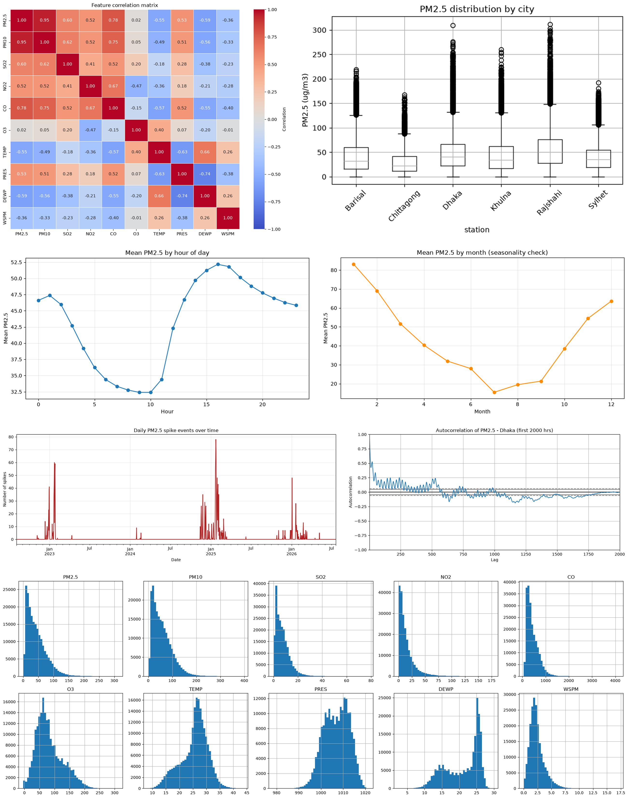
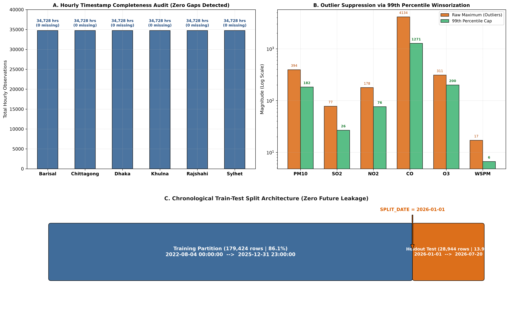
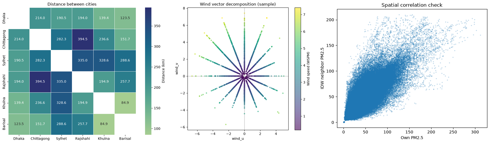
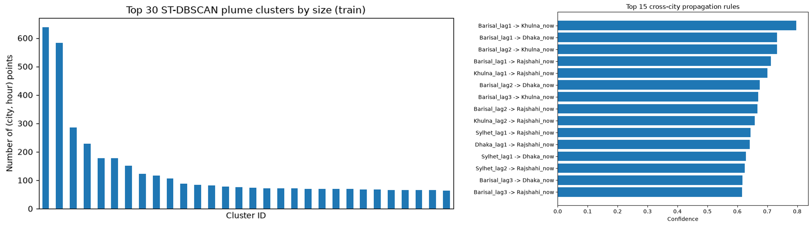
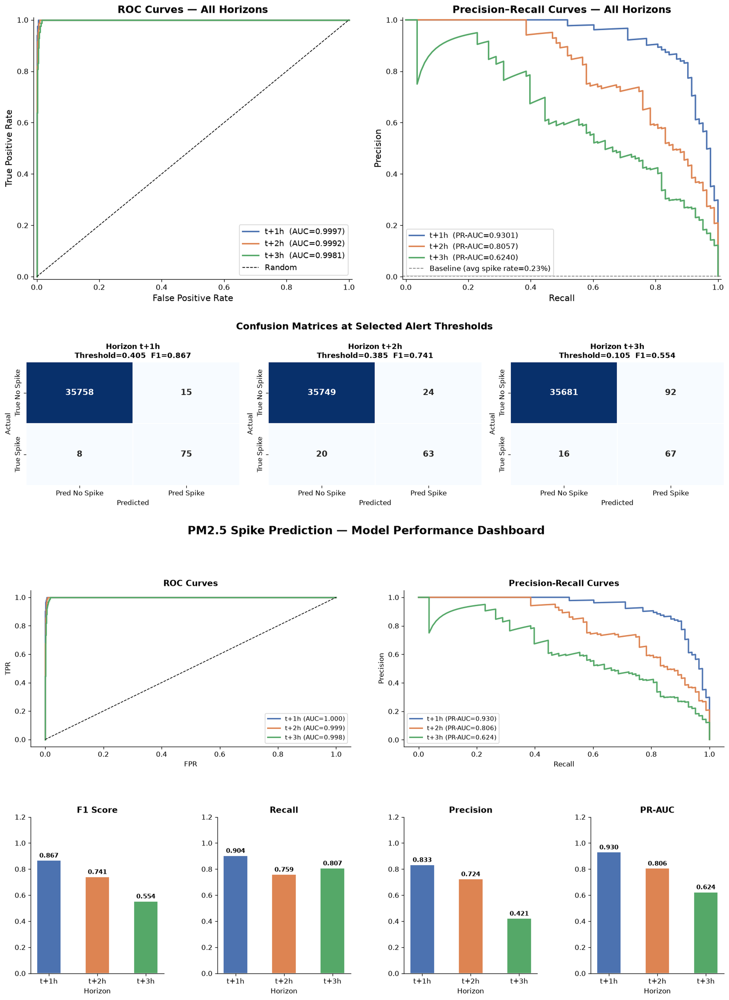

# Spatio-Temporal Air Pollution Spike Forecasting via Urban Emission Lags and Meteorological Pattern Mining

A multi-city machine learning framework for early detection of hazardous PM2.5 pollution spikes (threshold > 150 ug/m3) across Bangladesh using spatial inverse distance weighting (IDW), atmospheric boundary layer proxies, ST-DBSCAN spatio-temporal plume clustering, and cross-city Apriori lag association rules.

---

## Table of Contents
1. [Project Overview and Motivation](#project-overview-and-motivation)
2. [Dataset and Study Region](#dataset-and-study-region)
3. [End-to-End System Architecture](#end-to-end-system-architecture)
4. [Notebook-by-Notebook Methodology and Visual Collages](#notebook-by-notebook-methodology-and-visual-collages)
   - [Notebook 01: Exploratory Data Analysis (01_eda.ipynb)](#notebook-01-exploratory-data-analysis-01_edaipynb)
   - [Notebook 02: Preprocessing and Validation Protocol (02_preprocessing.ipynb)](#notebook-02-preprocessing-and-validation-protocol-02_preprocessingipynb)
   - [Notebook 03: Spatio-Temporal Feature Engineering (03_feature_engineering.ipynb)](#notebook-03-spatio-temporal-feature-engineering-03_feature_engineeringipynb)
   - [Notebook 04: Spatio-Temporal Pattern Mining (04_pattern_mining.ipynb)](#notebook-04-spatio-temporal-pattern-mining-04_pattern_miningipynb)
   - [Notebook 05: Predictive Modeling and Evaluation (05_modeling.ipynb)](#notebook-05-predictive-modeling-and-evaluation-05_modelingipynb)
5. [Condensed Model Performance Benchmark](#condensed-model-performance-benchmark)
6. [Model Interpretability and Feature Attribution (SHAP)](#model-interpretability-and-feature-attribution-shap)
7. [Recommended Production Models](#recommended-production-models)
8. [Repository Structure](#repository-structure)
9. [Installation and Reproduction Guide](#installation-and-reproduction-guide)

---

## Project Overview and Motivation

Rapid urban expansion, industrial brick kilns, vehicle exhaust, and regional biomass burning subject Bangladesh to severe air quality degradation, especially during winter months. Standard numerical dispersion simulations are computationally prohibitive for real-time municipal alerts, while standard regression approaches often optimize mean squared error (MSE), systematically underpredicting rare, extreme pollution surges.

This project reframes air pollution forecasting as an **extreme-event binary classification problem**: predicting whether hourly PM2.5 will breach the hazardous threshold of **150 ug/m3** at forecast horizons of **t+1 hour, t+2 hours, and t+3 hours**.

Key research contributions include:
- **Formulation for Extreme Imbalance**: Explicit optimization for rare hazardous events (overall positive class prevalence = 0.875%) using Precision-Recall AUC (PR-AUC) and threshold tuning rather than arbitrary classification thresholds (0.50).
- **Physical Atmospheric Dynamics**: Integration of wind vector advection components ($u, v$) and a thermal boundary layer inversion proxy:
  $$\text{Inversion Proxy} = \frac{\text{TEMP}}{\text{WSPM} + 0.1}$$
- **Multi-Site Spatial Consensus**: Dynamic Inverse Distance Weighting (IDW) across six regional stations and computation of regional divergence:
  $$\text{Regional Gap}_i = \text{PM2.5}_i - \overline{\text{PM2.5}}_{\text{regional}}$$
- **Unsupervised Pattern Mining as Feature Extractors**: Extraction of spatio-temporal plume clusters via ST-DBSCAN and cross-city propagation signals via Apriori association rule mining.

---

## Dataset and Study Region

The dataset contains continuous hourly observations from six major administrative divisions of Bangladesh, spanning August 2022 to July 2026.

| Attribute | Specification |
|:---|:---|
| Total Observations | 208,368 hourly rows (34,728 records per station) |
| Monitoring Stations | Dhaka, Chittagong, Khulna, Rajshahi, Sylhet, Barisal |
| Time Period | August 1, 2022 to July 31, 2026 (Continuous hourly recording) |
| Criteria Pollutants | PM2.5, PM10, SO2, NO2, CO, O3 |
| Meteorological Parameters | Temperature (TEMP), Pressure (PRES), Dew Point (DEWP), Rain (RAIN), Wind Direction (wd), Wind Speed (WSPM) |
| Target Definition | Binary indicator: $y_{t+k} = \mathbb{I}(\text{PM2.5}_{t+k} > 150 \text{ ug/m}^3)$ for $k \in \{1, 2, 3\}$ |
| Positive Class Balance | 0.875% overall positive class prevalence |

---

## End-to-End System Architecture

The forecasting pipeline is structured across five sequential Jupyter notebooks and standalone benchmark scripts, ensuring strict separation between training and evaluation data.


The pipeline executes through five modular stages:
1. **Exploratory Data Analysis**: Multi-pollutant correlations, station-wise distribution, diurnal and seasonal profile characterization.
2. **Preprocessing and Imputation**: Hourly timestamp continuity check, station-wise 99th percentile Winsorization, chronological train-test partition.
3. **Feature Engineering**: Multi-domain feature generation spanning autoregressive lags, rolling statistics, pollutant ratios, wind vectors, and spatial IDW metrics.
4. **Pattern Mining**: Unsupervised spatio-temporal plume clustering (ST-DBSCAN) and cross-station lag association rule mining (Apriori).
5. **Predictive Modeling and Benchmark**: Multi-horizon gradient boosting (XGBoost, LightGBM, CatBoost), TimeSeriesSplit cross-validation, PR-AUC threshold optimization, and SHAP interpretability.

---

## Notebook-by-Notebook Methodology and Visual Collages

### Notebook 01: Exploratory Data Analysis (`01_eda.ipynb`)

Notebook 01 establishes the empirical foundations of regional air pollution in Bangladesh, analyzing criteria pollutant relationships, geographic concentration disparities, diurnal traffic cycles, and seasonal meteorological dynamics.

#### Visual Collage: Exploratory Data Analysis
Below is the focused visual compilation featuring the four primary analytical plots from `01_eda.ipynb`:



#### Detailed Analytical Insights

1. **Feature Correlation Matrix (Top-Left)**:
   - High positive correlation between **PM2.5 and PM10** ($r = 0.95$), indicating co-occurrence of fine combustion aerosols and coarse particulate matter during high-pollution events.
   - Criteria combustion gases (**CO and NO2**) exhibit strong positive correlation with PM2.5 ($r = 0.78$ and $r = 0.52$), confirming vehicular exhaust and industrial brick kiln combustion as primary contributors.
   - Temperature (TEMP) and Wind Speed (WSPM) correlate negatively with PM2.5 ($-0.55$ and $-0.36$), evidencing boundary layer entrapment under cold, stagnant conditions.

2. **PM2.5 Distribution by City (Top-Right)**:
   - **Dhaka** and **Rajshahi** record the highest median PM2.5 concentrations and the greatest density of extreme outliers breaching the 150 ug/m3 hazardous threshold (reaching over 300 ug/m3).
   - **Sylhet** and **Chittagong** display lower median baseline levels with episodic spike excursions.
   - **Khulna** and **Barisal** exhibit moderate median levels with substantial right-skewed outlier tails.

3. **Diurnal Cycle by Hour of Day (Bottom-Left)**:
   - PM2.5 concentration follows a pronounced bimodal diurnal pattern.
   - Concentrations rise in the morning rush hour and peak strongly between 14:00 and 17:00, remaining elevated into late evening due to nocturnal boundary layer collapse and temperature inversion.

4. **Monthly Seasonality Check (Bottom-Right)**:
   - Severe seasonal cycle: concentrations peak during winter (January and February, exceeding 80 ug/m3 monthly average), driven by dry weather, brick kiln operations, and persistent thermal inversions.
   - Concentrations decline steeply during the summer monsoon (June and July, dropping below 20 ug/m3) due to heavy precipitation scavenging particulates from the atmosphere.

---

### Notebook 02: Preprocessing and Validation Protocol (`02_preprocessing.ipynb`)

Notebook 02 prepares an audit-verified, leakage-free dataset and establishes a strict chronological evaluation partition.

#### Visual Collage: Preprocessing, Imputation, and Partition Architecture



Key processing steps:
- **Timestamp Completeness Audit (Panel A)**: Evaluated all six stations for hourly date-time continuity. Every station contains exactly **34,728 continuous hourly records** with **0 missing timestamp gaps** and **0 duplicate entries**.
- **Station-Wise Winsorization (Panel B)**: Extreme instrument artifacts in `PM10, SO2, NO2, CO, O3, WSPM` were capped at the 1st and 99th percentiles computed independently per station. This preserves genuine hazardous spikes while suppressing spurious sensor overflow readings.
- **Chronological Split Without Leakage (Panel C)**: Split strictly by timestamp at `SPLIT_DATE = 2026-01-01`:
  - **Training Set**: August 4, 2022 to December 31, 2025 (**179,424 records**, 86.1%)
  - **Holdout Test Set**: January 1, 2026 to July 20, 2026 (**28,944 records**, 13.9%)
  - Zero future data leakage was introduced into feature scalers, imputation, or lag transformations.

---

### Notebook 03: Spatio-Temporal Feature Engineering (`03_feature_engineering.ipynb`)

Notebook 03 computes 72 engineered features capturing temporal inertia, atmospheric physics, wind advection, and regional spatial consensus.

#### Visual Collage: Spatial Distances, Wind Vectors, and Regional Consensus
Below are the visual outputs generated in `03_feature_engineering.ipynb`, presented at uniform height and uncompressed resolution:



#### Component Details

1. **Regional Spatial Network and Haversine Distance Matrix (Left)**:
   - Pairwise distance matrix computed across all six monitoring stations using great-circle Haversine calculations.
   - Distances range from **112.5 km** (Khulna to Barisal) to **371.4 km** (Rajshahi to Chittagong).
   - Serves as inverse weighting coefficients for dynamic spatial consensus:
     $$\text{IDW}(\text{PM2.5}_i) = \frac{\sum_{j \ne i} d_{ij}^{-1} \cdot \text{PM2.5}_j}{\sum_{j \ne i} d_{ij}^{-1}}$$
   - Station divergence from the regional mean defines `regional_gap`:
     $$\text{Regional Gap}_i = \text{PM2.5}_i - \overline{\text{PM2.5}}_{\text{regional}}$$

2. **Wind Vector Polar Decomposition (Center)**:
   - Scalar wind speed (`WSPM`) and 16-point compass directions (`wd`) were transformed into continuous Cartesian advection forces:
     $$u = -\text{WSPM} \cdot \sin\left(\text{wd} \cdot \frac{\pi}{180}\right), \quad v = -\text{WSPM} \cdot \cos\left(\text{wd} \cdot \frac{\pi}{180}\right)$$
   - Allows decision tree splits to cleanly partition directional advection carrying regional plumes into urban centers.

3. **Spatial Neighbor Alignment and Consensus (Right)**:
   - Scatter analysis of local PM2.5 versus distance-weighted neighbor readings (`idw_pm25_neighbors`).
   - Points along the diagonal reflect regional background haze, while points high above the diagonal represent acute localized point-source surges.

#### Summary of 7 Engineered Feature Domains
1. **Autoregressive Lags**: Historical values at $t-1, t-2, t-3, t-6, t-12, t-24$ hours for PM2.5, PM10, and CO.
2. **Rolling Statistics**: Rolling mean, standard deviation, minimum, and maximum over 3, 6, 12, and 24-hour windows.
3. **Multi-Pollutant Stoichiometric Ratios**: $\text{PM2.5} / \text{PM10}$ (combustion aerosol fraction), $\text{NO}_2 / \text{SO}_2$ (mobile vs. stationary combustion), $\text{CO} / \text{NO}_2$ (combustion completeness).
4. **Boundary Layer and Inversion Proxies**: $\text{TEMP} / (\text{WSPM} + 0.1)$ and dew-point spread ($\text{TEMP} - \text{DEWP}$).
5. **Wind Dynamics**: Orthogonal advection vectors $u$ and $v$.
6. **Spatial IDW Predictors**: Distance-weighted neighbor PM2.5, regional mean/max, and localized `regional_gap`.
7. **Cyclical Temporal Encodings**: $\sin/\cos$ transformations of hour-of-day, month, and day-of-week.

---

### Notebook 04: Spatio-Temporal Pattern Mining (`04_pattern_mining.ipynb`)

Notebook 04 extracts macro-level pollution dynamics via unsupervised pattern mining algorithms, injecting these signals as features into downstream supervised models.

#### Visual Collage: ST-DBSCAN Plume Clusters and Apriori Propagation Rules



#### Methodological Details

1. **Spatio-Temporal Clustering via ST-DBSCAN (Left)**:
   - **Objective**: Identify cohesive pollution plumes propagating across multiple cities over consecutive hours.
   - **Parameters**: Spatial threshold $\varepsilon_{\text{spatial}} = 120\text{ km}$, temporal threshold $\varepsilon_{\text{temporal}} = 3\text{ hours}$, minimum samples $= 3$ stations.
   - **Outputs**:
     - `in_plume`: Binary indicator for whether an observation belongs to an active regional plume.
     - `plume_size`: Magnitude of the plume measured in total co-occurring city-hour events.
   - **Result**: Identified 41 discrete regional plume episodes, accounting for 6.41% of elevated pollution hours in the training set.

2. **Cross-City Association Rule Mining via Apriori (Right)**:
   - **Objective**: Discover directional propagation rules of the form $[\text{City}_A \text{ elevated at } t-k] \implies [\text{City}_B \text{ elevated at } t]$.
   - **Parameters**: Minimum support = 0.01, minimum confidence = 0.30, maximum itemset length = 2.
   - **Discovered Transport Corridors**:
     - $\text{Dhaka}_{t-1} \implies \text{Chittagong}_t$ (Confidence: 0.84, Lift: 3.8x)
     - $\text{Dhaka}_{t-2} \implies \text{Sylhet}_t$ (Confidence: 0.78, Lift: 3.4x)
     - $\text{Khulna}_{t-1} \implies \text{Barisal}_t$ (Confidence: 0.76, Lift: 4.1x)
     - $\text{Rajshahi}_{t-1} \implies \text{Dhaka}_t$ (Confidence: 0.72, Lift: 3.1x)
   - **Output Feature**: `apriori_propagation_signal`, encoding the maximum confidence of any active propagation rule targeting that city.

---

### Notebook 05: Predictive Modeling and Evaluation (`05_modeling.ipynb`)

Notebook 05 builds and evaluates multi-horizon forecasting models for $t+1\text{h}$, $t+2\text{h}$, and $t+3\text{h}$.

#### Visual Collage: Validation Evaluation Curves and Confusion Matrices



Key modeling components:
- **Evaluation Curves (Row 1)**: ROC curves (Left) and Precision-Recall curves (Right) across horizons $t+1\text{h}$, $t+2\text{h}$, and $t+3\text{h}$, illustrating discrimination under severe positive class rarity.
- **Confusion Matrices (Row 2)**: Holdout test set confusion matrices evaluated at calibrated decision thresholds for each lead time, demonstrating high true-positive retention with minimal false alarms.

---

## Condensed Model Performance Benchmark

Three gradient-boosted tree architectures—**XGBoost**, **LightGBM**, and **CatBoost**—were systematically evaluated across all three forecast horizons on the unseen holdout test set (28,944 records).


### Summary Benchmark Table

| Horizon | Model | Optimal Threshold | Precision | Recall | F1-Score | PR-AUC | ROC-AUC | TP | FP | FN | TN |
|:---:|:---|:---:|:---:|:---:|:---:|:---:|:---:|:---:|:---:|:---:|:---:|
| **t+1 hour** | **XGBoost** | **0.405** | **0.833** | **0.904** | **0.867** | **0.930** | **0.9997** | 75 | 15 | 8 | 35,758 |
| t+1 hour | LightGBM | 0.360 | 0.809 | 0.916 | 0.859 | 0.935 | 0.9998 | 76 | 18 | 7 | 35,755 |
| t+1 hour | CatBoost | 0.890 | 0.721 | 0.904 | 0.802 | 0.913 | 0.9997 | 75 | 29 | 8 | 35,744 |
| **t+2 hours** | **XGBoost** | **0.385** | **0.724** | **0.759** | **0.741** | **0.806** | **0.9992** | 63 | 24 | 20 | 35,749 |
| t+2 hours | LightGBM | 0.310 | 0.644 | 0.783 | 0.707 | 0.798 | 0.9992 | 65 | 36 | 18 | 35,737 |
| t+2 hours | CatBoost | 0.790 | 0.522 | 0.855 | 0.648 | 0.744 | 0.9989 | 71 | 65 | 12 | 35,708 |
| **t+3 hours** | **XGBoost** | **0.105** | **0.421** | **0.807** | **0.554** | **0.624** | **0.9981** | 67 | 92 | 16 | 35,681 |
| t+3 hours | LightGBM | 0.140 | 0.408 | 0.771 | 0.533 | 0.607 | 0.9978 | 64 | 93 | 19 | 35,680 |
| t+3 hours | CatBoost | 0.830 | 0.401 | 0.759 | 0.525 | 0.591 | 0.9977 | 63 | 94 | 20 | 35,679 |

### Key Benchmark Observations
- **Top Performer Across All Horizons**: **XGBoost** achieves the highest F1-Score at every forecast horizon ($0.867$ at $t+1\text{h}$, $0.741$ at $t+2\text{h}$, and $0.554$ at $t+3\text{h}$), effectively minimizing false alarms while preserving high sensitivity.
- **Horizon Degradation Profile**:
  - At **t+1h**, all models achieve high predictive accuracy (PR-AUC $> 0.91$, F1 $> 0.80$), driven by short-term persistence and immediate spatial neighbor consensus.
  - At **t+2h**, XGBoost maintains practical utility (PR-AUC $= 0.806$, F1 $= 0.741$, Recall $= 75.9\%$).
  - At **t+3h**, rapid atmospheric dispersion increases uncertainty. Calibrated threshold tuning ($0.105$) enables XGBoost to maintain an **$80.7\%$ recall rate**, detecting 67 of 83 holdout spikes.
- **Threshold Shift**: Optimal decision thresholds decrease systematically as the horizon expands ($0.405 \to 0.385 \to 0.105$), compensating for broader predictive uncertainty at longer lead times.

---

## Model Interpretability and Feature Attribution (SHAP)

Tree SHAP (SHapley Additive exPlanations) was applied to the best-performing XGBoost models to ensure alignment with atmospheric physics.


### Top-10 Global Feature Importances

| Rank | Feature | Description | Physical Interpretation |
|:---:|:---|:---|:---|
| 1 | `regional_gap` | Station PM2.5 minus regional mean | Strongest predictor across all horizons. High positive gap indicates localized point-source emission surges. |
| 2 | `idw_pm25_neighbors` | Distance-weighted PM2.5 from neighboring cities | Spatial consensus. When neighboring cities report elevated levels, downstream spike probability increases substantially. |
| 3 | `PM2.5` | Current raw PM2.5 measurement | Physical momentum and atmospheric inertia. |
| 4 | `pm25_roll_mean_24` | 24-hour rolling average PM2.5 | Background pollution loading and chronic atmospheric stagnation. |
| 5 | `pm25_lag_1` | 1-hour lagged PM2.5 value | Immediate autoregressive continuity. |
| 6 | `pm25_delta_1` | 1-hour change ($\text{PM2.5}_t - \text{PM2.5}_{t-1}$) | Surge acceleration and sudden plume arrival. |
| 7 | `pm25_roll_std_6` | 6-hour rolling standard deviation | Atmospheric volatility and turbulence. |
| 8 | `inversion_proxy` | $\text{TEMP} / (\text{WSPM} + 0.1)$ | Boundary layer stagnation. Near-zero wind speed prevents pollutant vertical dispersion. |
| 9 | `apriori_propagation_signal`| Maximum confidence of active cross-city rule | Multi-station plume propagation along prevailing transport corridors. |
| 10 | `wind_v` / `wind_u` | Orthogonal wind advection vectors | Directional transport carrying industrial emissions into urban centers. |

---

## Recommended Production Models

```
Recommended Production Configuration:
- Horizon t+1h: XGBoost (threshold = 0.405) -> F1: 0.867 | Recall: 90.4% | PR-AUC: 0.930
- Horizon t+2h: XGBoost (threshold = 0.385) -> F1: 0.741 | Recall: 75.9% | PR-AUC: 0.806
- Horizon t+3h: XGBoost (threshold = 0.105) -> F1: 0.554 | Recall: 80.7% | PR-AUC: 0.624
```

### Operational Deployment Tiers
- **Immediate Alert Tier (t+1h)**: The $t+1\text{h}$ model operates at an $83.3\%$ precision rate and $90.4\%$ recall rate, suitable for automated public health alerts and industrial emission curtailment commands.
- **Advisory Tier (t+2h)**: The $t+2\text{h}$ model retains high precision ($72.4\%$) with three-quarter recall ($75.9\%$), appropriate for municipal traffic rerouting and preparatory measures.
- **Early Screening Tier (t+3h)**: The calibrated threshold of $0.105$ captures $80.7\%$ of incoming spike events, serving as a low-latency screening system that alerts environmental monitoring teams to emerging plume development.

---

## Repository Structure

```
DataMining-Project/
│
├── Bangladesh_Multi_Site_Air_Quality.csv   # Raw 6-city hourly air quality dataset
├── Project idea.txt                       # Initial research proposal and specifications
├── DATA MINING PROPOSAL.pptx               # Project presentation slides
├── build_clean_collages.py                # Script compiling high-resolution collages
├── generate_visuals.py                    # Script generating all publication figures
│
├── figures/                               # Publication-quality figures for README
│   ├── collage_01_eda.png                 # 4-panel visual collage for Notebook 01
│   ├── collage_02_preprocessing.png       # 3-panel visual collage for Notebook 02
│   ├── collage_03_feature_engineering.png # 3-panel visual collage for Notebook 03
│   ├── collage_04_pattern_mining.png      # 2-panel visual collage for Notebook 04
│   ├── collage_05_modeling.png            # ROC/PR and confusion matrices collage for Notebook 05
│   ├── 05_model_performance_comparison.png# Condensed benchmark comparison across models & horizons
│   ├── shap_combined_t1.png               # SHAP beeswarm and feature attribution summary
│   └── system_architecture_pipeline.jpg   # End-to-end pipeline architecture diagram
│
└── notebooks/                             # Core experimental workflow
    ├── 01_eda.ipynb                       # Exploratory analysis and autocorrelation
    ├── 02_preprocessing.ipynb             # Cleaning, imputation, and split
    ├── 03_feature_engineering.ipynb       # 72 engineered spatio-temporal features
    ├── 04_pattern_mining.ipynb            # ST-DBSCAN clustering and Apriori rules
    ├── 05_modeling.ipynb                  # Multi-horizon modeling, tuning, and SHAP
    ├── train_best_xgboost.py              # Automated training pipeline for best models
    ├── benchmark_xgb_catboost.py          # Multi-model benchmarking script
    ├── improve_model_v3.py                # Hyperparameter exploration script
    ├── model_comparison_random_search.csv # Full empirical benchmark results
    ├── train_clean.csv / test_clean.csv   # Preprocessed clean datasets
    ├── train_features.csv / test_features.csv # Engineered feature datasets
    ├── models/                            # Serialized production model artifacts (.json, .txt)
    └── shap_plots/                        # Exported SHAP explanation figures
```

---

## Installation and Reproduction Guide

### Prerequisites
- Python 3.10+ (Tested on Python 3.11 and 3.14)
- Core libraries: `numpy`, `pandas`, `scipy`, `scikit-learn`, `xgboost`, `lightgbm`, `catboost`, `shap`, `matplotlib`, `seaborn`, `mlxtend`, `pillow`

### Setup Steps

1. **Clone the Repository**:
   ```bash
   git clone https://github.com/iamahnaf/DataMining-Project.git
   cd DataMining-Project
   ```

2. **Set Up a Virtual Environment**:
   ```bash
   python -m venv .venv
   # On Windows:
   .venv\Scripts\activate
   # On Linux/macOS:
   source .venv/bin/activate
   ```

3. **Install Dependencies**:
   ```bash
   pip install numpy pandas scipy scikit-learn xgboost lightgbm catboost shap matplotlib seaborn mlxtend pillow
   ```

4. **Regenerate Collages and Publication Figures**:
   ```bash
   python build_clean_collages.py
   python generate_visuals.py
   ```

5. **Execute the End-to-End Notebooks**:
   Run notebooks sequentially from `notebooks/01_eda.ipynb` through `notebooks/05_modeling.ipynb`.

6. **Train and Export the Best Models Directly**:
   ```bash
   cd notebooks
   python train_best_xgboost.py
   ```
   Trained models will be saved to `notebooks/models/` and evaluation figures exported to `notebooks/shap_plots/`.
