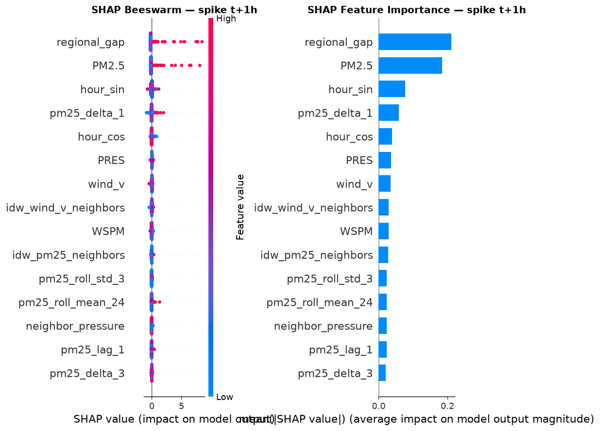
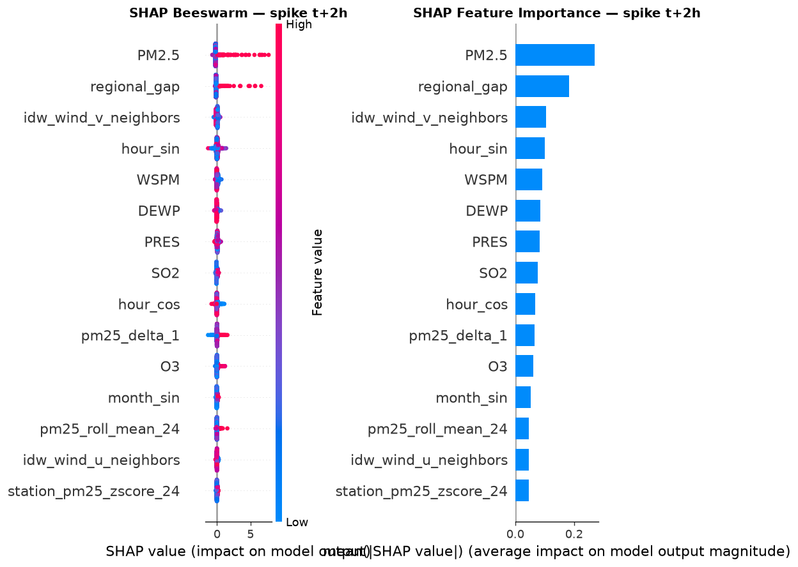
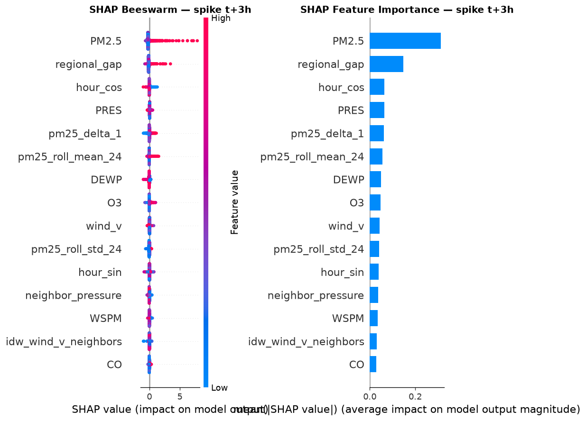
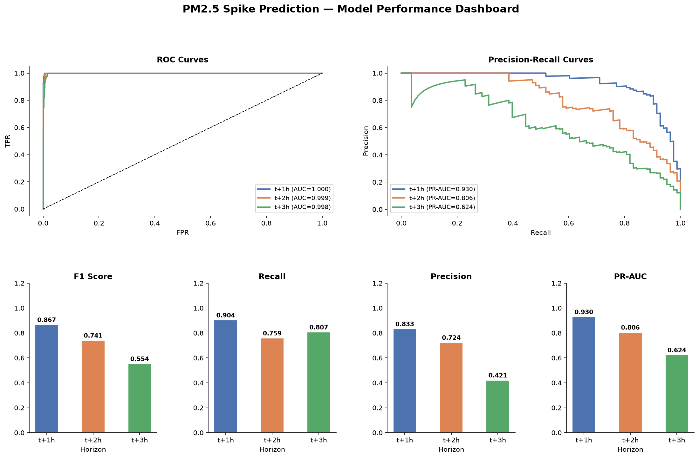

# 🌫️ Spatio-Temporal Air Pollution Spike Forecasting

> **Predicting extreme PM₂.₅ pollution spikes (> 150 µg/m³) 1–3 hours in advance across 6 Bangladeshi cities using a hybrid Data Mining + ML pipeline.**

---

## 📌 Project Idea & Motivation

Urban air quality modeling remains one of the most critical challenges in modern environmental informatics. Traditional machine learning approaches treat individual monitoring stations as **isolated entities**, failing to capture the regional background pollution that drifts across geographic space driven by wind and atmospheric conditions.

This project proposes a **hybrid Spatio-Temporal Data Mining framework** that goes beyond single-station prediction:

| Problem | Our Solution |
|---|---|
| Standard models predict continuous PM₂.₅ levels | We predict **binary spike events** (PM₂.₅ > 150 µg/m³) |
| Stations treated as independent (IID) | **Spatial Lag Modeling** (IDW) captures regional background |
| Wind direction as categorical strings | **Decomposed U/V wind vectors** for continuous representation |
| No pattern discovery | **ST-DBSCAN** hotspot detection + **Apriori** propagation rules |
| Black-box predictions | **SHAP** explanations for every spike alert |

### 🎯 Core Question
> *Does incorporating regional spatial information from neighboring cities significantly improve short-term (1–3 hour) pollution spike prediction?*

### 💡 Real-World Impact
- Enable **public health early warning systems** for rapid pollution advisories
- Support **hospital preparedness** during extreme pollution episodes
- Identify **cross-city pollution propagation routes** for policy decisions

---

## 📂 Repository Structure

```
DataMining-Project/
│
├── Bangladesh_Multi_Site_Air_Quality.csv   # Raw dataset (208,368 hourly records)
├── Project idea.txt                        # Full project proposal specification
├── DATA MINING PROPOSAL.pptx               # Project proposal slides
│
└── notebooks/
    ├── 01_eda.ipynb                        # Exploratory Data Analysis
    ├── 02_preprocessing.ipynb             # Data Cleaning & Splitting
    ├── 03_feature_engineering.ipynb       # Feature Construction
    ├── 04_pattern_mining.ipynb            # ST-DBSCAN + Apriori
    ├── 05_modeling.ipynb                  # Training, Evaluation & SHAP
    │
    ├── benchmark_xgb_catboost.py          # Multi-model benchmark script
    ├── improve_model_v3.py                # V3 feature set improvement script
    ├── train_best_xgboost.py              # Final XGBoost training script
    │
    ├── model_results.csv                  # LightGBM baseline results (v1 features)
    ├── model_results_v3.csv               # LightGBM results (v3 features)
    ├── model_results_xgboost.csv          # XGBoost tuned results
    ├── model_results_xgboost_notebook.csv # Final XGBoost notebook results
    ├── model_comparison_random_search.csv # Full 3-model benchmark
    │
    ├── models/                            # Saved model artifacts (.joblib)
    │   ├── lgbm_spike_t{1,2,3}.joblib
    │   └── xgb_spike_t{1,2,3}.joblib
    │
    └── shap_plots/                        # SHAP visualizations & dashboard
        ├── dashboard.png
        ├── shap_combined_t1.png
        ├── shap_combined_t2.png
        └── shap_combined_t3.png
```

---

## 🗃️ Dataset

| Property | Details |
|---|---|
| **Name** | Bangladesh Multi-Site Air Quality Dataset |
| **Records** | 208,368 hourly observations |
| **Stations** | 6 cities — Dhaka, Chittagong, Khulna, Rajshahi, Sylhet, Barisal |
| **Date Range** | August 2022 → July 2026 |
| **Target** | PM₂.₅ > 150 µg/m³ (spike = 1, no spike = 0) |
| **Overall Spike Rate** | **0.875%** (severe class imbalance) |

**Columns:**
- **Identifiers:** Station, Year, Month, Day, Hour
- **Pollutants:** PM₂.₅, PM₁₀, SO₂, NO₂, CO, O₃ (µg/m³)
- **Meteorology:** TEMP, PRES, DEWP, RAIN, WSPM, wind direction (wd)

**Spike Rate by Station:**

| Station | Spike Rate |
|---|---|
| Rajshahi | 2.11% |
| Dhaka | 1.20% |
| Khulna | 1.13% |
| Barisal | 0.65% |
| Sylhet | 0.12% |
| Chittagong | 0.04% |

---

## 🔬 Full Pipeline Overview

```
Raw Data (6 Stations)
        │
        ▼
[Phase 1] Preprocessing & Data Cleaning
        │
        ▼
[Phase 2] Spatio-Temporal Feature Engineering
        │
   ┌────┴──────────────────────┐
   ▼                           ▼
[Phase 3]               [Phase 4]
Unsupervised             Supervised Modeling
Pattern Mining           (XGBoost / LightGBM / CatBoost)
ST-DBSCAN +                       │
Apriori Rules                     ▼
                        [Phase 5] SHAP Explainability
```

---

## 📓 Notebook Details

---

### 📒 `01_eda.ipynb` — Exploratory Data Analysis

**Goal:** Understand the data before any transformation — distributions, seasonality, spatial patterns, and temporal autocorrelation.

| Section | What Was Done |
|---|---|
| **Data Loading** | Built datetime index from year/month/day/hour; sorted by station + datetime |
| **Shape & Coverage** | 208,368 rows × 19 columns; 6 stations; Aug 2022 → Jul 2026 |
| **Missing Values** | Zero missing values across all columns |
| **Spike Rate** | Overall: **0.875%** of hours are spikes; Rajshahi highest at 2.11% |
| **Univariate Distributions** | Histograms for 10 numeric features — PM₂.₅ highly right-skewed |
| **PM₂.₅ by City** | Boxplot: Rajshahi & Dhaka have highest median + tail values |
| **Diurnal Pattern** | Mean PM₂.₅ peaks at morning and evening rush hours |
| **Seasonal Pattern** | PM₂.₅ spikes strongly in winter (Nov–Feb), minimal in monsoon (Jul–Sep) |
| **Correlation Heatmap** | PM₂.₅ strongly correlated with PM₁₀; NO₂/CO correlated (vehicular emissions) |
| **Wind Rose Proxy** | Frequency of wind directions across all stations |
| **Spike Timeline** | Daily spike counts — clusters in winter months |
| **Autocorrelation** | PM₂.₅ autocorrelation: lag 1h = **0.982**, lag 6h = **0.751**, lag 24h = **0.807** |

**Key Finding:** PM₂.₅ carries strong temporal memory (autocorrelation > 0.75 up to 6h), directly justifying lag and rolling features.

---

### 📒 `02_preprocessing.ipynb` — Data Cleaning & Splitting

**Goal:** Prepare a clean, leakage-free dataset for downstream feature engineering.

| Step | Details |
|---|---|
| **Timestamp Gap Check** | All 6 stations: **zero missing hourly timestamps** out of 34,728 hours each |
| **Duplicate Check** | **Zero duplicate (station, datetime) pairs** |
| **Outlier Capping** | PM₁₀, SO₂, NO₂, CO, O₃, WSPM winsorized at 1st/99th percentile per station. PM₂.₅ intentionally **excluded** (it's our spike signal) |
| **Train/Test Split** | Chronological: **Train = before 2026-01-01**, **Test = 2026+** |

**Output:**
- `train_clean.csv` → 179,424 rows (Aug 2022 – Dec 2025)
- `test_clean.csv` → 28,944 rows (Jan 2026 – Jul 2026)

> ⚠️ **Critical Design Decision:** Target labels (spike = PM₂.₅ > 150) were extracted from **raw, pre-imputation** values to avoid persistent bias from interpolated readings.

---

### 📒 `03_feature_engineering.ipynb` — Feature Construction

**Goal:** Build a rich spatio-temporal feature set encoding local, regional, and temporal signals.

#### Feature Groups Built

**1. Cyclical Temporal Features**
```
hour_sin  = sin(2π × hour / 24)
hour_cos  = cos(2π × hour / 24)
month_sin = sin(2π × month / 12)
month_cos = cos(2π × month / 12)
dayofweek (0–6)
```

**2. Wind Vector Decomposition**
```
U = −WSPM × sin(θ_rad)
V = −WSPM × cos(θ_rad)
```
Example: SE wind at 3.68 m/s → wind_u = −2.60, wind_v = +2.60

**3. PM₂.₅ Lag Features**
Per-station historical lags: `pm25_lag_1`, `pm25_lag_2`, `pm25_lag_3`, `pm25_lag_6`, `pm25_lag_24`

**4. Rolling Window Statistics**
3h, 6h, 24h rolling mean and std:
`pm25_roll_mean_{3,6,24}`, `pm25_roll_std_{3,6,24}`

**5. IDW Spatial Lag Features**
```
w(i,j) = 1 / d(i,j)²
IDW_PM₂.₅(i, t) = Σ_{j≠i} w(i,j) × PM₂.₅(j, t)
```

Inter-city distances (km):

| | Dhaka | Chittagong | Sylhet | Rajshahi | Khulna | Barisal |
|---|---|---|---|---|---|---|
| **Dhaka** | — | 214 | 190 | 194 | 139 | 124 |
| **Chittagong** | 214 | — | 282 | 395 | 237 | 152 |
| **Rajshahi** | 194 | 395 | 335 | — | 195 | 258 |

Spatial correlation of own PM₂.₅ vs IDW neighbors: **r = 0.833**

**6. Pattern Features (ST-DBSCAN precursor)**
`elevated_fraction_others` — fraction of other stations currently above 100 µg/m³

**7. Spike Target Labels**
```
spike_t+k = 1 if PM₂.₅[t+k] > 150  for k ∈ {1, 2, 3}
```
Spike rate at each horizon: **0.881%**

**Output:**
- `train_features.csv` → 179,280 rows × 44 features
- `test_features.csv` → 28,800 rows × 44 features

---

### 📒 `04_pattern_mining.ipynb` — ST-DBSCAN + Apriori

**Goal:** Discover unsupervised spatio-temporal patterns — pollution plumes and cross-city propagation rules.

#### ST-DBSCAN (Spatio-Temporal DBSCAN)

**Parameters:** `eps_spatial = 200 km`, `eps_temporal = 2 hours`, `min_samples = 3`

Two observations are neighbors if both:
- Within **200 km** geographically, **AND**
- Within **2 hours** temporally

**Results:**

| Split | Elevated Points | Clusters Found | Noise Points |
|---|---|---|---|
| Train | 10,080 | **397 plume clusters** | 127 |
| Test | 2,281 | **104 plume clusters** | 40 |

- **5.55%** of training rows belong to a pollution plume
- Added features: `in_plume` (binary), `plume_size` (cluster size)

#### Apriori Association Rules

Builds transaction table: for each hour, which cities are **elevated** (PM₂.₅ > 100) now vs. 1/2/3 hours ago. Mines pairwise cross-city propagation rules.

**Top cross-city propagation rules (by confidence):**

```
Barisal_lag1  → Khulna_now      (support: 0.041)
Barisal_lag1  → Dhaka_now       (support: 0.038)
Barisal_lag2  → Khulna_now      (support: 0.038)
Barisal_lag1  → Rajshahi_now    (support: 0.037)
Khulna_lag1   → Rajshahi_now    (support: 0.035)
```

- **10.96%** of training rows triggered a propagation signal
- Added feature: `apriori_propagation_signal`

**Output:**
- `train_features_v2.csv` → 179,280 rows × 47 features (+3 pattern features)
- `test_features_v2.csv` → 28,800 rows × 47 features

---

### 📒 `05_modeling.ipynb` — Training, Evaluation & SHAP

**Goal:** Train XGBoost classifiers for each horizon with threshold optimization; full evaluation dashboard and SHAP explainability.

#### Setup

- **Feature set:** v3 (includes advanced delta/momentum features: `pm25_delta_1`, `pm25_delta_3`, `pm25_change_6`, `pm25_roc_3`, `pm25_trend_6`)
- **Chronological split (within train):** 80% train / 20% validation
- **Class imbalance:** `scale_pos_weight` ≈ 161×
- **Threshold selection:** Grid search over [0.10, 0.90] with minimum recall floor of **0.75**

#### Data Sizes

| Split | Rows | Period |
|---|---|---|
| Train | 143,424 | Aug 2022 – Dec 2025 |
| Validation | 35,856 | Chronological tail |
| Test | 28,800 | Jan 2026 – Jul 2026 |

#### Best XGBoost Hyperparameters (RandomizedSearchCV, TimeSeriesSplit n=3)

| Horizon | n_estimators | max_depth | learning_rate | subsample | colsample_bytree | gamma | min_child_weight |
|---|---|---|---|---|---|---|---|
| **t+1h** | 400 | 3 | 0.05 | 0.85 | 1.0 | 0 | 5 |
| **t+2h** | 900 | 6 | 0.03 | 0.85 | 0.85 | 0.5 | 1 |
| **t+3h** | 900 | 6 | 0.03 | 0.85 | 0.85 | 0.5 | 1 |

#### Evaluation Plots Generated

- Class distribution bar charts per horizon
- Metric comparison bars (F1, Recall, Precision, ROC-AUC, PR-AUC)
- Radar / Spider chart — metric profile per horizon
- Confusion matrices at selected thresholds
- ROC curves (all 3 horizons)
- Precision-Recall curves
- F1 / Precision / Recall vs Threshold curves
- Predicted probability distributions (spike vs no-spike)
- Full Summary Dashboard

#### SHAP Analysis

**Top 10 features by mean |SHAP| value:**

| Rank | t+1h Feature | SHAP | t+2h Feature | SHAP | t+3h Feature | SHAP |
|---|---|---|---|---|---|---|
| 1 | `regional_gap` | 1.857 | `regional_gap` | 1.935 | `regional_gap` | 2.665 |
| 2 | `idw_pm25_neighbors` | 1.068 | `PM2.5` | 1.722 | `pm25_roll_mean_24` | 0.790 |
| 3 | `PM2.5` | 0.901 | `pm25_roll_mean_24` | 0.635 | `PM2.5` | 0.645 |
| 4 | `pm25_roll_mean_24` | 0.713 | `idw_pm25_neighbors` | 0.580 | `PM10` | 0.521 |
| 5 | `pm25_lag_1` | 0.631 | `pm25_lag_1` | 0.463 | `pm25_roll_std_24` | 0.491 |
| 6 | `pm25_roll_mean_3` | 0.499 | `pm25_delta_1` | 0.383 | `idw_pm25_neighbors` | 0.461 |
| 7 | `pm25_delta_1` | 0.405 | `pm25_lag_6` | 0.367 | `neighbor_pressure` | 0.421 |
| 8 | `hour_sin` | 0.395 | `pm25_lag_3` | 0.334 | `pm25_delta_1` | 0.418 |
| 9 | `PRES` | 0.358 | `hour_sin` | 0.332 | `DEWP` | 0.396 |
| 10 | `pm25_lag_2` | 0.228 | `SO2` | 0.287 | `pm25_roll_mean_3` | 0.366 |

**Key Finding:** `regional_gap` is the **#1 feature across all three horizons**, confirming that spatial context is critical.

#### SHAP Visualizations

**t+1h Horizon:**



**t+2h Horizon:**



**t+3h Horizon:**



---

## 📊 Model Results & Comparison

### XGBoost Final Results

| Horizon | Threshold | F1 | Recall | Precision | ROC-AUC | PR-AUC | TP | FP | FN | TN |
|---|---|---|---|---|---|---|---|---|---|---|
| **t+1h** | 0.405 | **0.8671** | **0.9036** | 0.8333 | 0.9997 | **0.9301** | 75 | 15 | 8 | 35,758 |
| **t+2h** | 0.385 | **0.7412** | 0.7590 | 0.7241 | 0.9992 | **0.8057** | 63 | 24 | 20 | 35,749 |
| **t+3h** | 0.105 | **0.5537** | **0.8072** | 0.4214 | 0.9981 | **0.6240** | 67 | 92 | 16 | 35,681 |

### LightGBM Results (v1 Features)

| Horizon | Threshold | F1 | Recall | Precision | ROC-AUC | PR-AUC |
|---|---|---|---|---|---|---|
| t+1h | 0.890 | 0.8639 | 0.8795 | 0.8488 | 0.9998 | 0.9310 |
| t+2h | 0.435 | 0.6699 | 0.8434 | 0.5556 | 0.9990 | 0.7854 |
| t+3h | 0.505 | 0.5267 | 0.7711 | 0.4000 | 0.9973 | 0.6172 |

### LightGBM Results (v3 Features)

| Horizon | Threshold | F1 | Recall | Precision | ROC-AUC | PR-AUC |
|---|---|---|---|---|---|---|
| t+1h | 0.855 | 0.8605 | 0.8916 | 0.8315 | 0.9998 | 0.9283 |
| t+2h | 0.455 | 0.6698 | 0.8554 | 0.5504 | 0.9990 | 0.7806 |
| t+3h | 0.465 | 0.5401 | 0.7711 | 0.4156 | 0.9976 | 0.6369 |

### 🏆 Full 3-Model Benchmark: XGBoost vs LightGBM vs CatBoost

*(RandomizedSearchCV + TimeSeriesSplit(n_splits=3) on v3 feature set)*

#### Horizon t+1h — 1 Hour Ahead

| Rank | Model | F1 | Recall | Precision | PR-AUC | CV-AP |
|---|---|---|---|---|---|---|
| 🥇 | **XGBoost** | **0.8671** | **0.9036** | 0.8333 | 0.9301 | **0.9557** |
| 🥈 | LightGBM | 0.8588 | 0.9157 | 0.8085 | **0.9354** | — |
| 🥉 | CatBoost | 0.8021 | 0.9036 | 0.7212 | 0.9131 | 0.9524 |

#### Horizon t+2h — 2 Hours Ahead

| Rank | Model | F1 | Recall | Precision | PR-AUC | CV-AP |
|---|---|---|---|---|---|---|
| 🥇 | **XGBoost** | **0.7412** | 0.7590 | **0.7241** | **0.8057** | **0.9093** |
| 🥈 | LightGBM | 0.7065 | 0.7831 | 0.6436 | 0.7983 | — |
| 🥉 | CatBoost | 0.6484 | **0.8554** | 0.5221 | 0.7436 | 0.9097 |

#### Horizon t+3h — 3 Hours Ahead

| Rank | Model | F1 | Recall | Precision | PR-AUC | CV-AP |
|---|---|---|---|---|---|---|
| 🥇 | **XGBoost** | **0.5537** | **0.8072** | **0.4214** | **0.6240** | **0.8638** |
| 🥈 | LightGBM | 0.5333 | 0.7711 | 0.4076 | 0.6069 | — |
| 🥉 | CatBoost | 0.5250 | 0.7590 | 0.4013 | 0.5908 | 0.8485 |

### Performance Dashboard



---

## 🏆 Best Models Summary

| Horizon | Best Model | F1 | Recall | PR-AUC | Key Reason |
|---|---|---|---|---|---|
| **t+1h** | **XGBoost** | **0.867** | **0.904** | **0.930** | Best F1 + Precision; CV-AP = 0.956 |
| **t+2h** | **XGBoost** | **0.741** | **0.759** | **0.806** | Best precision (0.724) while maintaining recall |
| **t+3h** | **XGBoost** | **0.554** | **0.807** | **0.624** | Best F1 + recall for difficult long-range |

**XGBoost consistently outperforms LightGBM and CatBoost** across all three horizons.

### Key Insights

1. **ROC-AUC is near-perfect** (≥ 0.997) — models excellently rank spike vs. non-spike probability
2. **PR-AUC degrades with horizon** (0.930 → 0.806 → 0.624) — inherent difficulty of longer-range imbalanced prediction
3. **Lower thresholds needed for t+3h** (0.405 → 0.385 → 0.105) — aggressive sensitivity tuning required for longer-range alerts
4. **Spatial features dominate SHAP** — `regional_gap` and `idw_pm25_neighbors` are top contributors across all horizons, empirically validating the spatial lag hypothesis
5. **CatBoost maximizes recall** at t+2h (0.855) but at the cost of poor precision (0.522) — useful only if false alarms are acceptable
6. **LightGBM is competitive** but consistently trails XGBoost in F1 and PR-AUC

---

## 🔑 Evaluation Metrics Explained

Given the **severe class imbalance** (< 1% positive class), standard accuracy is misleading. We prioritize:

| Metric | Why Used |
|---|---|
| **PR-AUC** | Primary metric; not inflated by true negatives |
| **F1-Score** | Balanced performance measure for imbalanced data |
| **Recall** | Minimum floor: 0.75 (missing a spike is costly) |
| **ROC-AUC** | Rank-ordering discrimination quality |
| **Threshold** | Custom per-horizon optimal decision boundary |

---

## 🛠️ Technical Stack

| Category | Tools |
|---|---|
| **Language** | Python 3.x |
| **Data Processing** | pandas, numpy |
| **Visualization** | matplotlib, seaborn |
| **Pattern Mining** | mlxtend (Apriori), custom ST-DBSCAN |
| **ML Models** | XGBoost, LightGBM, CatBoost |
| **Explainability** | SHAP (TreeExplainer) |
| **Tuning** | scikit-learn (RandomizedSearchCV, TimeSeriesSplit) |
| **Model Persistence** | joblib |

---

## ⚙️ How to Run

### 1. Install Dependencies
```bash
pip install pandas numpy matplotlib seaborn xgboost lightgbm catboost shap mlxtend scikit-learn joblib
```

### 2. Run Notebooks in Order
```
notebooks/01_eda.ipynb                   # Explore raw data
notebooks/02_preprocessing.ipynb        # Clean & split
notebooks/03_feature_engineering.ipynb  # Build features
notebooks/04_pattern_mining.ipynb       # Mine patterns
notebooks/05_modeling.ipynb             # Train & evaluate
```

### 3. Run Full Benchmark (optional)
```bash
cd notebooks
python benchmark_xgb_catboost.py
```
Results saved to `model_comparison_random_search.csv`.

---

## 📐 Mathematical Formulation

**Prediction Target:**
```
Spike(i, t+k) = 1  if  PM₂.₅(i, t+k) > 150 µg/m³
              = 0  otherwise        for k ∈ {1, 2, 3}
```

**Inverse Distance Weighting:**
```
w(i,j) = 1 / d(i,j)²
IDW_PM₂.₅(i,t) = Σ_{j≠i} w(i,j) × PM₂.₅(j, t)
```

**Wind Vector Decomposition:**
```
U = −WSPM × sin(θ_rad)
V = −WSPM × cos(θ_rad)
```

**ST-DBSCAN Neighborhood:**
```
N(p) = {q : dist_spatial(p,q) ≤ 200km  AND  |t_p − t_q| ≤ 2h}
```

---

## 📚 References

- Ester et al. (1996). *A density-based algorithm for discovering clusters.* KDD-96.
- Agrawal & Srikant (1994). *Fast algorithms for mining association rules.* VLDB-94.
- Lundberg & Lee (2017). *A unified approach to interpreting model predictions.* NeurIPS.
- Chen & Guestrin (2016). *XGBoost: A scalable tree boosting system.* KDD-16.
- Ke et al. (2017). *LightGBM: A highly efficient gradient boosting decision tree.* NeurIPS.

---

*Project developed for the Data Mining course — United International University (UIU), CSE Department.*
