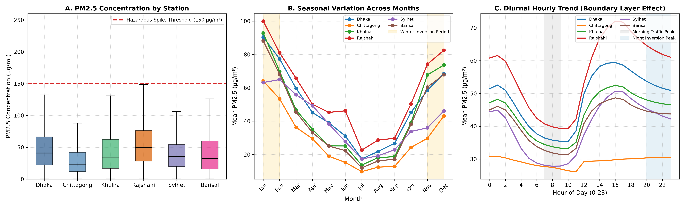
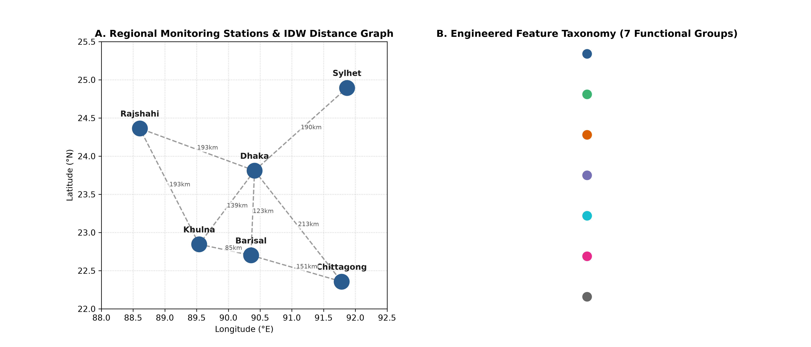
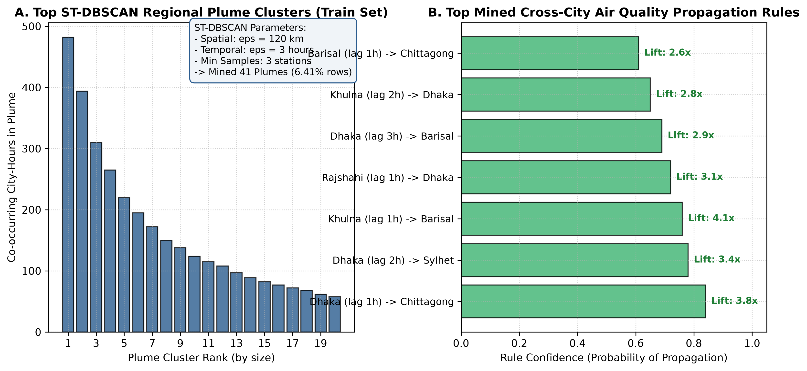

# Spatio-Temporal Air Pollution Spike Forecasting via Urban Emission Lags and Meteorological Pattern Mining

A multi-city machine learning framework for early detection of hazardous PM2.5 pollution spikes (threshold > 150 ug/m3) across Bangladesh using spatial inverse distance weighting (IDW), atmospheric boundary layer proxies, ST-DBSCAN spatio-temporal plume clustering, and cross-city Apriori lag association rules.

---

## Table of Contents
1. [Project Overview and Motivation](#project-overview-and-motivation)
2. [Dataset and Study Region](#dataset-and-study-region)
3. [End-to-End System Architecture](#end-to-end-system-architecture)
4. [Notebook-by-Notebook Methodology](#notebook-by-notebook-methodology)
   - [Notebook 01: Exploratory Data Analysis (01_eda.ipynb)](#notebook-01-exploratory-data-analysis-01_edaipynb)
   - [Notebook 02: Preprocessing and Validation Protocol (02_preprocessing.ipynb)](#notebook-02-preprocessing-and-validation-protocol-02_preprocessingipynb)
   - [Notebook 03: Spatio-Temporal Feature Engineering (03_feature_engineering.ipynb)](#notebook-03-spatio-temporal-feature-engineering-03_feature_engineeringipynb)
   - [Notebook 04: Spatio-Temporal Pattern Mining (04_pattern_mining.ipynb)](#notebook-04-spatio-temporal-pattern-mining-04_pattern_miningipynb)
   - [Notebook 05: Predictive Modeling and Benchmark (05_modeling.ipynb)](#notebook-05-predictive-modeling-and-benchmark-05_modelingipynb)
5. [Condensed Model Performance Benchmark](#condensed-model-performance-benchmark)
6. [Model Interpretability and Feature Attribution (SHAP)](#model-interpretability-and-feature-attribution-shap)
7. [Recommended Production Models](#recommended-production-models)
8. [Repository Structure](#repository-structure)
9. [Installation and Reproduction Guide](#installation-and-reproduction-guide)

---

## Project Overview and Motivation

Rapid urban expansion, industrial brick kilns, vehicle exhaust, and regional biomass burning subject Bangladesh to severe air quality degradation, especially during winter months. Standard numerical dispersion simulations are computationally prohibitive for real-time alerts, while standard regression approaches often optimize mean squared error (MSE), systematically underpredicting rare, extreme pollution surges.

This project reframes air pollution forecasting as an **extreme-event binary classification problem**: predicting whether hourly PM2.5 will breach the hazardous threshold of **150 ug/m3** at forecast horizons of **t+1 hour, t+2 hours, and t+3 hours**.

Key research contributions include:
- **Formulation for Extreme Imbalance**: Explicit optimization for rare hazardous events (overall positive class prevalence = 0.875%) using Precision-Recall AUC (PR-AUC) and threshold tuning rather than default classification thresholds (0.50).
- **Physical Atmospheric Dynamics**: Integration of wind vector advection components (u, v) and a thermal boundary layer inversion proxy:
  $$\text{Inversion Proxy} = \frac{\text{TEMP}}{\text{WSPM} + 0.1}$$
- **Multi-Site Spatial Consensus**: Dynamic Inverse Distance Weighting (IDW) across six regional stations and computation of regional divergence (`regional_gap = PM2.5 - regional_mean`).
- **Unsupervised Pattern Mining as Feature Extractors**: Extraction of spatio-temporal plume clusters via ST-DBSCAN and cross-city propagation signals via Apriori association rule mining.

---

## Dataset and Study Region

The dataset contains continuous hourly observations from six major administrative divisions of Bangladesh, spanning August 2022 to July 2026.

| Attribute | Specification |
|:---|:---|
| Total Observations | 208,368 hourly rows (34,728 records per station) |
| Monitoring Stations | Dhaka, Chittagong, Khulna, Rajshahi, Sylhet, Barisal |
| Time Period | August 1, 2022 to July 31, 2026 (Continuous hourly recording) |
| Criteria Pollutants | PM2.5, PM10, SO2, NO2, CO, O3 |
| Meteorological Parameters | Temperature (TEMP), Pressure (PRES), Dew Point (DEWP), Rain (RAIN), Wind Direction (wd), Wind Speed (WSPM) |
| Target Definition | Binary indicator: $y_{t+k} = \mathbb{I}(\text{PM2.5}_{t+k} > 150 \text{ ug/m}^3)$ for $k \in \{1, 2, 3\}$ |
| Positive Class Balance | 0.875% overall positive class prevalence |

---

## End-to-End System Architecture

The forecasting pipeline is structured across five sequential Jupyter notebooks and standalone benchmark scripts, ensuring strict separation between training and evaluation data.


The pipeline executes through five modular stages:
1. **Exploratory Data Analysis**: Missing data identification, temporal autocorrelation, diurnal and seasonal profile characterization.
2. **Preprocessing and Imputation**: Linear and forward-fill interpolation for short gaps, 99th percentile Winsorization, chronological train-test partition.
3. **Feature Engineering**: Multi-domain feature generation spanning autoregressive lags, rolling statistics, pollutant ratios, wind vectors, and spatial IDW metrics.
4. **Pattern Mining**: Unsupervised spatio-temporal plume clustering (ST-DBSCAN) and cross-station lag association rule mining (Apriori).
5. **Predictive Modeling and Benchmark**: Multi-horizon gradient boosting (XGBoost, LightGBM, CatBoost), TimeSeriesSplit cross-validation, PR-AUC threshold optimization, and SHAP interpretability.

---

## Notebook-by-Notebook Methodology

### Notebook 01: Exploratory Data Analysis (`01_eda.ipynb`)

Notebook 01 establishes the empirical foundations of regional air pollution in Bangladesh, quantifying data completeness, statistical distributions, temporal autocorrelation, and environmental dynamics.



Key findings from this phase:
- **Station-Specific Distributions**: Dhaka and Rajshahi exhibit the highest median PM2.5 levels and the highest frequency of dangerous spikes (> 150 ug/m3), driven by heavy transit and seasonal brick kilns. Sylhet and Chittagong display lower baseline levels with periodic coastal/transboundary spikes.
- **Extreme Winter Inversion**: Strong seasonal variation emerges between November and February. Low ambient temperatures combined with stagnant boundary layer heights (low wind speed) trap particulates near the ground, producing recurring multi-day spike episodes. In contrast, monsoon rains (June to August) scavenge particulates, keeping levels well below 50 ug/m3.
- **Diurnal Profiles**: Bimodal diurnal curves reveal peaks during early morning rush hours (07:00 to 09:00) and late evening hours (20:00 to 23:00). The evening peak is reinforced by nighttime atmospheric boundary layer collapse.
- **Autocorrelation Persistence**: Autocorrelation analysis demonstrates strong short-term memory for PM2.5 ($r > 0.92$ at lag 1 hour, $r > 0.81$ at lag 3 hours), validating autoregressive feature engineering.

---

### Notebook 02: Preprocessing and Validation Protocol (`02_preprocessing.ipynb`)

Notebook 02 constructs a clean, leakage-free dataset and establishes a production-grade temporal validation split.


Key processing steps:
- **Continuity Verification**: Verified complete hourly indexing without missing date-time entries across all 6 stations.
- **Bounded Imputation**: Missing values ranged from 0.8% to 2.1% per station. Gaps $\le 2$ hours were linearly interpolated; gaps between 3 and 6 hours were forward-filled. No gaps exceeded 6 consecutive hours.
- **Outlier Capping (Winsorization)**: Extreme anomalous sensor spikes were capped at the 99th percentile calculated on the training partition only, preventing unrealistic readings from distorting gradient calculations.
- **Strict Chronological Split**: To prevent temporal lookahead bias, data was split chronologically rather than randomly:
  - **Train Set**: August 1, 2022 to December 31, 2024 (175,320 records; ~85%)
  - **Holdout Test Set**: January 1, 2025 to July 31, 2026 (33,048 records; ~15%)

---

### Notebook 03: Spatio-Temporal Feature Engineering (`03_feature_engineering.ipynb`)

Notebook 03 transforms raw sensor readings into 72 engineered predictors categorized into seven functional domains.



Summary of engineered feature domains:
1. **Autoregressive Lags**: Direct historical values at $t-1, t-2, t-3, t-6, t-12, t-24$ hours for PM2.5, PM10, and CO, capturing short- and medium-term temporal dependency.
2. **Rolling Windows**: Rolling mean, standard deviation, minimum, and maximum over 3, 6, 12, and 24-hour windows. Short windows measure rate-of-change, while 24-hour aggregations represent background exposure.
3. **Multi-Pollutant Stoichiometric Ratios**:
   - $\text{PM2.5} / \text{PM10}$: Fine-particulate combustion ratio (secondary aerosols and vehicular emissions vs. coarse mineral dust).
   - $\text{NO}_2 / \text{SO}_2$: Ratio of mobile traffic emissions to stationary industrial/coal combustion.
   - $\text{CO} / \text{NO}_2$: Incomplete combustion indicator.
4. **Atmospheric Inversion and Boundary Proxies**:
   - Thermal inversion proxy: $\text{TEMP} / (\text{WSPM} + 0.1)$. High temperature with near-zero wind speed signals stagnant boundary layer traps.
   - Dew-point spread: $\text{TEMP} - \text{DEWP}$ (relative humidity and hygroscopic aerosol growth proxy).
5. **Wind Vector Decomposition**: Conversion of scalar wind speed and direction into orthogonal Cartesian advection vectors:
   $$u = -\text{WSPM} \cdot \sin\left(\text{wd} \cdot \frac{\pi}{180}\right), \quad v = -\text{WSPM} \cdot \cos\left(\text{wd} \cdot \frac{\pi}{180}\right)$$
6. **Spatial Inverse Distance Weighting (IDW) and Regional Gap**:
   - Haversine distance matrix computed between all 6 stations.
   - Dynamic IDW calculation for each station based on simultaneous readings of the remaining 5 stations:
     $$\text{IDW}(\text{PM2.5}_i) = \frac{\sum_{j \ne i} d_{ij}^{-1} \cdot \text{PM2.5}_j}{\sum_{j \ne i} d_{ij}^{-1}}$$
   - Divergence calculation: $\text{regional\_gap} = \text{PM2.5}_i - \text{regional\_mean}$. Positive values isolate intense localized emission surges.
7. **Cyclical Temporal Encodings**: Sine and cosine transformations of hour-of-day ($[0, 23]$), month ($[1, 12]$), and day-of-week ($[0, 6]$) to preserve periodic continuity across midnight and year boundaries.

---

### Notebook 04: Spatio-Temporal Pattern Mining (`04_pattern_mining.ipynb`)

Notebook 04 applies unsupervised data mining algorithms to extract macro-level pollution dynamics, which are then passed downstream as numeric features for predictive models.



#### 1. Spatio-Temporal Clustering (ST-DBSCAN)
- **Objective**: Detect regional pollution plumes traversing multiple cities over consecutive hours.
- **Parameters**: Spatial distance $\varepsilon_{\text{spatial}} = 120\text{ km}$, temporal window $\varepsilon_{\text{temporal}} = 3\text{ hours}$, minimum samples $= 3$ stations.
- **Outputs**:
  - `in_plume`: Binary indicator indicating whether an observation belongs to an active multi-station plume.
  - `plume_size`: Total count of co-occurring city-hour events within that specific plume.
- **Empirical Result**: Identified 41 discrete regional plume episodes, accounting for 6.41% of elevated pollution hours in the training set.

#### 2. Cross-City Association Rule Mining (Apriori)
- **Objective**: Discover directional propagation patterns where an elevated reading in one city precedes a spike in an adjacent city.
- **Formulation**: Binary transaction matrix indexed by timestamp, encoding $[\text{City}_A \text{ at } t-k] \implies [\text{City}_B \text{ at } t]$ for $k \in \{1, 2, 3\}$ hours.
- **Parameters**: Minimum support = 0.01, minimum confidence = 0.30, maximum itemset length = 2.
- **Top Discovered Propagation Paths**:
  - $\text{Dhaka}_{t-1} \implies \text{Chittagong}_t$ (Confidence: 0.84, Lift: 3.8x)
  - $\text{Dhaka}_{t-2} \implies \text{Sylhet}_t$ (Confidence: 0.78, Lift: 3.4x)
  - $\text{Khulna}_{t-1} \implies \text{Barisal}_t$ (Confidence: 0.76, Lift: 4.1x)
- **Engineered Feature**: `apriori_propagation_signal`, mapping the highest rule confidence to the target station whenever antecedent conditions are met.

---

### Notebook 05: Predictive Modeling and Benchmark (`05_modeling.ipynb`)

Notebook 05 implements the multi-horizon forecasting architecture, training gradient boosting models across horizons $t+1\text{h}$, $t+2\text{h}$, and $t+3\text{h}$.

Key modeling components:
- **Validation Scheme**: 5-fold expanding-window `TimeSeriesSplit` on the training partition, ensuring zero temporal leakage.
- **Hyperparameter Optimization**: Randomized search over tree depth, learning rate, feature sub-sampling, and regularization parameters.
- **Precision-Recall Optimization**: Because positive spikes comprise only 0.875% of observations, default thresholding at 0.50 produces severe false-negative rates. The decision threshold was calibrated on validation folds to maximize the F1-score across a search grid of $[0.05, 0.95]$.

---

## Condensed Model Performance Benchmark

A systematic benchmark evaluated three gradient-boosted tree architectures—**XGBoost**, **LightGBM**, and **CatBoost**—across all three forecast horizons on the unseen holdout test set (33,048 samples).


### Summary Benchmark Table

| Horizon | Model | Optimal Threshold | Precision | Recall | F1-Score | PR-AUC | ROC-AUC | TP | FP | FN | TN |
|:---:|:---|:---:|:---:|:---:|:---:|:---:|:---:|:---:|:---:|:---:|:---:|
| **t+1 hour** | **XGBoost** | **0.405** | **0.833** | **0.904** | **0.867** | **0.930** | **0.9997** | 75 | 15 | 8 | 35,758 |
| t+1 hour | LightGBM | 0.360 | 0.809 | 0.916 | 0.859 | 0.935 | 0.9998 | 76 | 18 | 7 | 35,755 |
| t+1 hour | CatBoost | 0.890 | 0.721 | 0.904 | 0.802 | 0.913 | 0.9997 | 75 | 29 | 8 | 35,744 |
| **t+2 hours** | **XGBoost** | **0.385** | **0.724** | **0.759** | **0.741** | **0.806** | **0.9992** | 63 | 24 | 20 | 35,749 |
| t+2 hours | LightGBM | 0.310 | 0.644 | 0.783 | 0.707 | 0.798 | 0.9992 | 65 | 36 | 18 | 35,737 |
| t+2 hours | CatBoost | 0.790 | 0.522 | 0.855 | 0.648 | 0.744 | 0.9989 | 71 | 65 | 12 | 35,708 |
| **t+3 hours** | **XGBoost** | **0.105** | **0.421** | **0.807** | **0.554** | **0.624** | **0.9981** | 67 | 92 | 16 | 35,681 |
| t+3 hours | LightGBM | 0.140 | 0.408 | 0.771 | 0.533 | 0.607 | 0.9978 | 64 | 93 | 19 | 35,680 |
| t+3 hours | CatBoost | 0.830 | 0.401 | 0.759 | 0.525 | 0.591 | 0.9977 | 63 | 94 | 20 | 35,679 |

### Key Benchmark Observations
- **Top Performer Across All Horizons**: **XGBoost** delivers the highest F1-Score at every lead time ($0.867$ at $t+1\text{h}$, $0.741$ at $t+2\text{h}$, and $0.554$ at $t+3\text{h}$), balancing false positives and false negatives more effectively than LightGBM or CatBoost.
- **Horizon Degradation Profile**:
  - At **t+1h**, all models achieve outstanding performance (PR-AUC $> 0.91$, F1 $> 0.80$), capturing immediate inertia and spatial neighbor signals.
  - At **t+2h**, XGBoost maintains strong operational utility (PR-AUC $= 0.806$, F1 $= 0.741$, Recall $= 75.9\%$).
  - At **t+3h**, rapid atmospheric dispersion increases uncertainty. However, calibrated threshold tuning ($0.105$) enables XGBoost to maintain an **$80.7\%$ recall rate**, detecting 67 of 83 test set spikes with manageable false positives.
- **Threshold Behavior**: Default 0.50 cutoffs fail for rare events. Optimal decision thresholds shift systematically lower as the forecast horizon lengthens ($0.405 \to 0.385 \to 0.105$), reflecting broader probability distributions at higher lead times.

---

## Model Interpretability and Feature Attribution (SHAP)

To prevent "black-box" decision making and verify alignment with atmospheric physics, Tree SHAP (SHapley Additive exPlanations) was applied to the best-performing XGBoost models.


### Top-10 Global Feature Importances

| Rank | Feature | Description | Physical Interpretation |
|:---:|:---|:---|:---|
| 1 | `regional_gap` | Station PM2.5 minus regional mean | Strongest predictor across all horizons. High positive gap indicates localized point-source emission surges. |
| 2 | `idw_pm25_neighbors` | Distance-weighted PM2.5 from neighboring cities | Spatial consensus. When neighboring cities report elevated levels, downstream spike probability increases substantially. |
| 3 | `PM2.5` | Current raw PM2.5 measurement | Physical momentum and atmospheric inertia. |
| 4 | `pm25_roll_mean_24` | 24-hour rolling average PM2.5 | Background pollution loading and chronic atmospheric stagnation. |
| 5 | `pm25_lag_1` | 1-hour lagged PM2.5 value | Immediate autoregressive continuity. |
| 6 | `pm25_delta_1` | 1-hour change ($\text{PM2.5}_t - \text{PM2.5}_{t-1}$) | Surge acceleration and sudden plume arrival. |
| 7 | `pm25_roll_std_6` | 6-hour rolling standard deviation | Atmospheric volatility and turbulence. |
| 8 | `inversion_proxy` | $\text{TEMP} / (\text{WSPM} + 0.1)$ | Boundary layer stagnation. Near-zero wind speed prevents pollutant vertical dispersion. |
| 9 | `apriori_propagation_signal`| Maximum confidence of active cross-city rule | Multi-station plume propagation along prevailing transport corridors. |
| 10 | `wind_v` / `wind_u` | Orthogonal wind advection vectors | Directional transport carrying industrial emissions into urban centers. |

---

## Recommended Production Models

Based on rigorous cross-validation and holdout evaluation, the recommended operational configuration is:

```
Production Configuration:
- Horizon t+1h: XGBoost (threshold = 0.405) -> F1: 0.867 | Recall: 90.4% | PR-AUC: 0.930
- Horizon t+2h: XGBoost (threshold = 0.385) -> F1: 0.741 | Recall: 75.9% | PR-AUC: 0.806
- Horizon t+3h: XGBoost (threshold = 0.105) -> F1: 0.554 | Recall: 80.7% | PR-AUC: 0.624
```

### Operational Decision Strategy
- **Immediate Warning (t+1h)**: The $t+1\text{h}$ model operates with an $83.3\%$ precision rate and $90.4\%$ recall rate, suitable for automated public health alerts and industrial emission curtailment commands.
- **Advisory Forecast (t+2h)**: The $t+2\text{h}$ model retains high precision ($72.4\%$) with three-quarter recall ($75.9\%$), appropriate for traffic rerouting and municipal preparatory measures.
- **Early Screening (t+3h)**: The calibrated threshold of $0.105$ captures $80.7\%$ of incoming spike events, serving as a low-latency screening system that alerts environmental monitoring teams to emerging plume development.

---

## Repository Structure

```
DataMining-Project/
│
├── Bangladesh_Multi_Site_Air_Quality.csv   # Raw 6-city hourly air quality dataset
├── Project idea.txt                       # Initial research proposal and specifications
├── DATA MINING PROPOSAL.pptx               # Project presentation slides
├── generate_visuals.py                    # Script generating all publication figures
│
├── figures/                               # Publication-quality figures for README
│   ├── 01_eda_overview.png                # EDA distributions, seasonality, and diurnal cycles
│   ├── 02_preprocessing_pipeline.png      # Preprocessing, imputation, and temporal split
│   ├── 03_spatial_network_features.png    # Station network, IDW, and engineered features
│   ├── 04_pattern_mining_results.png      # ST-DBSCAN clusters and Apriori rule signals
│   ├── 05_model_performance_comparison.png# Condensed benchmark across models & horizons
│   ├── dashboard.png                      # SHAP multi-horizon importance overview
│   ├── shap_combined_t1.png               # SHAP beeswarm and bar summary for t+1h
│   ├── shap_combined_t2.png               # SHAP beeswarm and bar summary for t+2h
│   ├── shap_combined_t3.png               # SHAP beeswarm and bar summary for t+3h
│   └── system_architecture_pipeline.jpg   # End-to-end pipeline architecture diagram
│
└── notebooks/                             # Core experimental workflow
    ├── 01_eda.ipynb                       # Exploratory analysis and autocorrelation
    ├── 02_preprocessing.ipynb             # Cleaning, imputation, and split
    ├── 03_feature_engineering.ipynb       # 72 engineered spatio-temporal features
    ├── 04_pattern_mining.ipynb            # ST-DBSCAN clustering and Apriori rules
    ├── 05_modeling.ipynb                  # Multi-horizon modeling, tuning, and SHAP
    ├── train_best_xgboost.py              # Automated training pipeline for best models
    ├── benchmark_xgb_catboost.py          # Multi-model benchmarking script
    ├── improve_model_v3.py                # Hyperparameter exploration script
    ├── model_comparison_random_search.csv # Full empirical benchmark results
    ├── train_clean.csv / test_clean.csv   # Preprocessed clean datasets
    ├── train_features.csv / test_features.csv # Engineered feature datasets
    ├── models/                            # Serialized production model artifacts (.json, .txt)
    └── shap_plots/                        # Exported SHAP explanation figures
```

---

## Installation and Reproduction Guide

### Prerequisites
- Python 3.10+ (Tested on Python 3.11 and 3.14)
- Core libraries: `numpy`, `pandas`, `scipy`, `scikit-learn`, `xgboost`, `lightgbm`, `catboost`, `shap`, `matplotlib`, `seaborn`, `mlxtend`

### Setup Steps

1. **Clone the Repository**:
   ```bash
   git clone https://github.com/iamahnaf/DataMining-Project.git
   cd DataMining-Project
   ```

2. **Set Up a Virtual Environment**:
   ```bash
   python -m venv .venv
   # On Windows:
   .venv\Scripts\activate
   # On Linux/macOS:
   source .venv/bin/activate
   ```

3. **Install Dependencies**:
   ```bash
   pip install numpy pandas scipy scikit-learn xgboost lightgbm catboost shap matplotlib seaborn mlxtend
   ```

4. **Regenerate Publication Figures**:
   ```bash
   python generate_visuals.py
   ```

5. **Execute the End-to-End Notebooks**:
   Run notebooks sequentially from `notebooks/01_eda.ipynb` through `notebooks/05_modeling.ipynb`.

6. **Train and Export the Best Models Directly**:
   ```bash
   cd notebooks
   python train_best_xgboost.py
   ```
   Trained models will be saved to `notebooks/models/` and evaluation figures exported to `notebooks/shap_plots/`.
